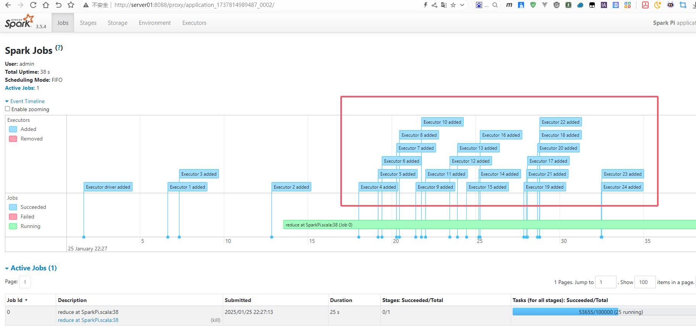

# Spark3

Apache Spark 是一个开源的大数据处理框架，旨在快速处理大规模数据集。它提供了分布式计算能力，支持批处理和流处理。Spark 提供了丰富的API，支持多种编程语言（如Java、Scala、Python、R），并且能在不同的集群管理器（如Hadoop YARN、Kubernetes）上运行。Spark 通过内存计算和高度优化的执行引擎，显著提高了数据处理速度，广泛应用于数据分析、机器学习和图计算等领域。

- [官网链接](https://spark.apache.org/)


## 基础配置

**下载软件包**

```
wget https://dlcdn.apache.org/spark/spark-3.5.4/spark-3.5.4-bin-hadoop3.tgz
```

**解压软件包**

```
tar -zxvf spark-3.5.4-bin-hadoop3.tgz -C /usr/local/software/
ln -s /usr/local/software/spark-3.5.4-bin-hadoop3 /usr/local/software/spark
```

**配置环境变量**

```
cat >> ~/.bash_profile <<"EOF"
## SPARK_HOME
export SPARK_HOME=/usr/local/software/spark
export PATH=$PATH:$SPARK_HOME/bin
EOF
source ~/.bash_profile
```

**查看版本**

```
spark-shell --version
```


## Spark on YARN

Spark on YARN 是一种运行 Apache Spark 的模式，利用 Hadoop 的资源管理框架 YARN（Yet Another Resource Negotiator）来分配和管理资源。它支持集群模式和客户端模式，能够高效地协调 Spark 的作业调度和资源分配。Spark on YARN 可以与 Hadoop 分布式文件系统（HDFS）无缝集成，适用于大规模数据处理场景，具有高容错性和弹性扩展的特点。

有两种部署模式可用于在 YARN 上启动 Spark 应用程序。在cluster模式下，Spark 驱动程序在集群上由 YARN 管理的应用程序主进程内运行，客户端可以在启动应用程序后离开。在client模式下，驱动程序运行在客户端进程中，应用程序主机仅用于向 YARN 请求资源。

- [官网链接](https://spark.apache.org/docs/latest/running-on-yarn.html)

**配置spark-env.sh**

```
cp $SPARK_HOME/conf/{spark-env.sh.template,spark-env.sh}
cat > $SPARK_HOME/conf/spark-env.sh <<"EOF"
export HADOOP_HOME=/usr/local/software/hadoop
export HADOOP_CONF_DIR=$HADOOP_HOME/etc/hadoop
export LD_LIBRARY_PATH=$HADOOP_HOME/lib/native
EOF
```

**配置spark-defaults.conf**

```
cat > $SPARK_HOME/conf/spark-defaults.conf <<"EOF"
## Spark on YARN
spark.master yarn
spark.submit.deployMode client
## Spark Config
spark.eventLog.enabled true
spark.eventLog.dir hdfs://bigdata01:8020/tmp/logs/spark
spark.eventLog.rolling.enabled true
spark.eventLog.rolling.maxFileSize 128m
spark.history.ui.port 18080
spark.history.retainedApplications 50
spark.history.fs.logDirectory hdfs://bigdata01:8020/tmp/logs/spark
spark.driver.cores 1
spark.driver.memory 1g
spark.driver.memoryOverhead 1g
spark.executor.instances 2
spark.executor.cores 1
spark.executor.memory 2g
spark.executor.memoryOverhead 1g
spark.task.maxFailures 8
spark.sql.shuffle.partitions 8
spark.default.paralleism 8
EOF
```

**创建日志目录**

```
hadoop fs -mkdir -p /tmp/logs/spark
```

**运行程序**

客户端运行，适合开发调试，会打印日志

```
spark-submit --master yarn \
    --class org.apache.spark.examples.SparkPi \
    --deploy-mode client \
    --num-executors 3 \
    $SPARK_HOME/examples/jars/spark-examples_2.12-3.5.4.jar 1000
```

服务端运行，日志在yarn集群上

```
spark-submit --master yarn \
    --class org.apache.spark.examples.SparkPi \
    --deploy-mode cluster \
    --num-executors 3 \
    --name "PI计算" \
    $SPARK_HOME/examples/jars/spark-examples_2.12-3.5.4.jar 1000
```

查看日志

```
yarn logs -applicationId application_1737640156298_0008 -log_files stdout
```


## 动态资源配置

拷贝依赖包到所有yarn节点上

```
cp $SPARK_HOME/yarn/spark-3.5.4-yarn-shuffle.jar $HADOOP_HOME/share/hadoop/yarn/
```

yarn-site.xml修改配置

> 修改yarn.nodemanager.aux-services配置
>
> 新增yarn.nodemanager.aux-services.spark_shuffle.class配置

```
$ vi $HADOOP_HOME/etc/hadoop/yarn-site.xml
<configuration>
    ...
    <!-- Spark on YARN动态资源配置-->
    <property>
        <name>yarn.nodemanager.aux-services</name>
        <value>spark_shuffle,mapreduce_shuffle</value>
    </property>
    <property>
        <name>yarn.nodemanager.aux-services.spark_shuffle.class</name>
        <value>org.apache.spark.network.yarn.YarnShuffleService</value>
    </property>
</configuration>
```

重启集群所有NodeManager

```
sudo systemctl restart hadoop-yarn-*
```

配置spark-defaults.conf

```
$ vi $SPARK_HOME/conf/spark-defaults.conf
...
## 开启动态资源以及申请的Executors数最值
spark.shuffle.service.enabled           true
spark.shuffle.service.port              7337
spark.shuffle.service.removeShuffle     true
spark.dynamicAllocation.enabled         true
spark.dynamicAllocation.initExectors    2
spark.dynamicAllocation.minExecutors    2
spark.dynamicAllocation.maxExecutors    30
```

启动spark任务

```
spark-submit --master yarn \
    --class org.apache.spark.examples.SparkPi \
    --deploy-mode cluster \
    $SPARK_HOME/examples/jars/spark-examples_2.12-3.5.4.jar 10000
```

从以下图片可以看到在动态的增加Executor


