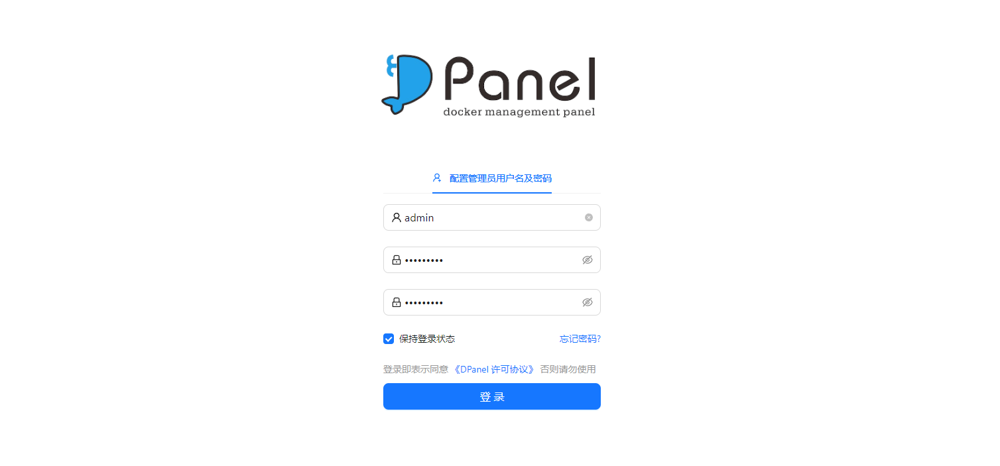
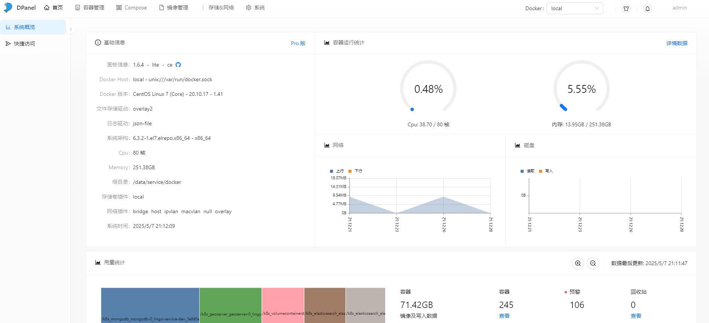

# DPanel

轻量化 docker 可视化管理面板。

- [官网链接](https://github.com/donknap/dpanel)

**下载镜像**

```
docker pull dpanel/dpanel:lite
```

**推送到仓库**

```
docker tag dpanel/dpanel:lite registry.lingo.local/service/dpanel:lite
docker push registry.lingo.local/service/dpanel:lite
```

**保存镜像**

```
docker save registry.lingo.local/service/dpanel:lite | gzip -c > image-dpanel_lite.tar.gz
```

**创建目录**

```
sudo mkdir -p /data/container/dpanel
sudo chown 100 -R /data/container/dpanel
```

**运行服务**

注意：环境变量的 `APP_NAME` 需要和容器名称保持一致

```
export APP_NAME=ateng-dpanel
docker run -d --name ${APP_NAME} \
  -p 20028:8080  --restart=always \
  -e APP_NAME=${APP_NAME} \
  -v /var/run/docker.sock:/var/run/docker.sock \
  -v /data/container/dpanel:/dpanel \
  registry.lingo.local/service/dpanel:lite
```

**查看日志**

```
docker logs -f ateng-dpanel
```

**使用服务**

```
URL: http://192.168.1.12:20028
```





**删除服务**

停止服务

```
docker stop ateng-dpanel
```

删除服务

```
docker rm ateng-dpanel
```

删除目录

```
sudo rm -rf /data/container/dpanel
```

