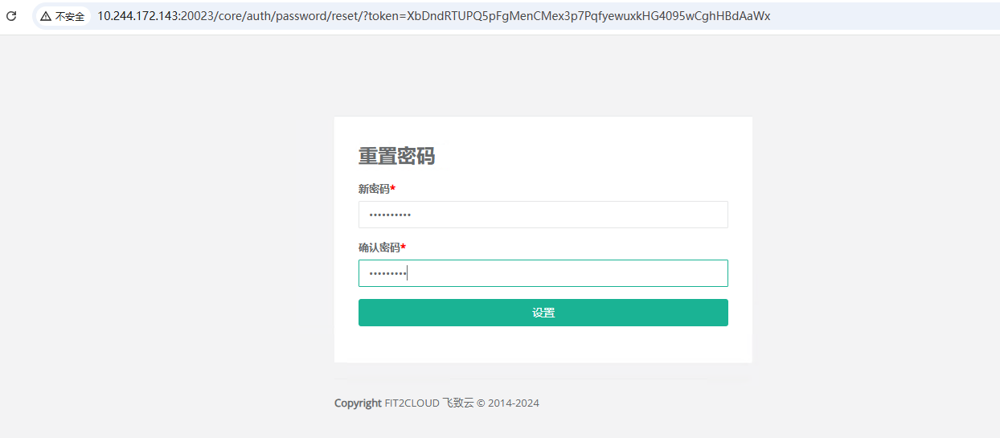
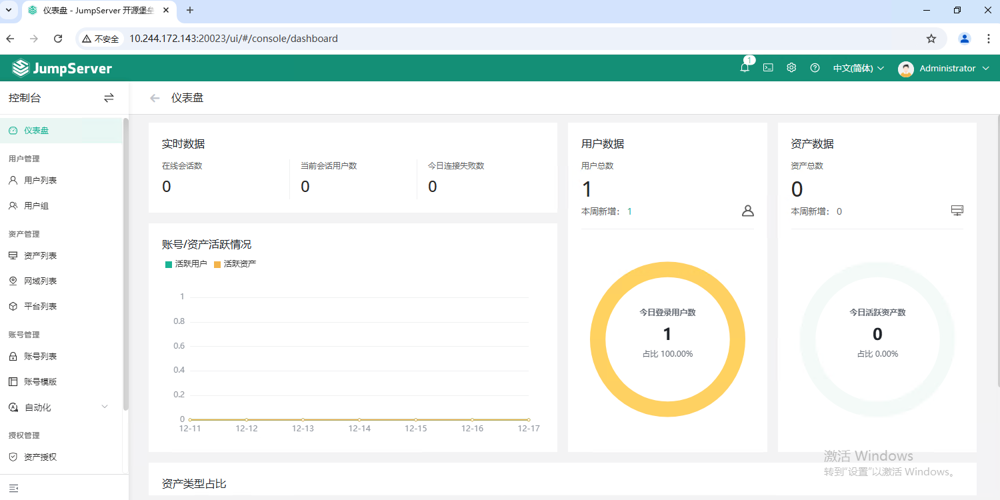

# JumpServer

JumpServer 是广受欢迎的开源堡垒机，是符合 4A 规范的专业运维安全审计系统。JumpServer 帮助企业以更安全的方式管控和登录所有类型的资产，实现事前授权、事中监察、事后审计，满足等保合规要求。

- [官方文档](https://docs.jumpserver.org/zh/v4/)

**前提条件**

- 需要 [postgresql](/work/docker/service/postgresql/) 数据库

**下载镜像**

```
docker pull jumpserver/jms_all:v4.3.1
```

**推送到仓库**

```
docker tag jumpserver/jms_all:v4.3.1 registry.lingo.local/service/jms_all:v4.3.1
docker push registry.lingo.local/service/jms_all:v4.3.1
```

**保存镜像**

```
docker save registry.lingo.local/service/jms_all:v4.3.1 | gzip -c > image-jms_all_v4.3.1.tar.gz
```

**创建目录**

```
sudo mkdir -p /data/container/jumpserver/jsdata
```

**创建数据库**

该步骤仅供参考，具体根据实际情况而定

```
docker exec -it ateng-postgresql bash
export PGPASSWORD=Admin@123
psql --host 10.244.172.143 -U postgres -d postgres -p 20002
CREATE USER jumpserver WITH PASSWORD 'Jumpserver@123';
CREATE DATABASE ateng_jumpserver OWNER jumpserver;
```

**运行服务**

注意以下配置

- SECRET_KEY 和 BOOTSTRAP_TOKEN 可选修改
- DOMAINS：访问Web的地址，根据实际情况修改
- DB_*: PostgreSQL相关的信息

```
docker run -d --name ateng-jumpserver \
  -p 20023:80 --restart=always \
  -v /data/container/jumpserver/jsdata:/opt/data \
  -e SECRET_KEY=qT5y7JsyVf84Eu4s5UdeffAEiTHvJ4f9iVdD2oLs4cq2C651 \
  -e BOOTSTRAP_TOKEN=q5CpPMW5zBKRft0rRrb9FDOC \
  -e DOMAINS="demo.jumpserver.org:443,10.244.172.143:20023" \
  -e DB_ENGINE=postgresql \
  -e DB_HOST=10.244.172.143 \
  -e DB_PORT=20002 \
  -e DB_USER=jumpserver \
  -e DB_PASSWORD=Jumpserver@123 \
  -e DB_NAME=ateng_jumpserver \
  -e TZ=Asia/Shanghai \
  registry.lingo.local/service/jms_all:v4.3.1
```

**查看日志**

```
docker logs -f ateng-jumpserver
```

**使用服务**

```
URL: http://10.244.172.143:20023
Username: admin
Password: ChangeMe
```

登录后会提示修改密码，例如这里修改为：Admin@123，修改后需要重新登录





**删除服务**

停止服务

```
docker stop ateng-jumpserver
```

删除服务

```
docker rm ateng-jumpserver
```

删除目录

```
sudo rm -rf /data/container/jumpserver
```

