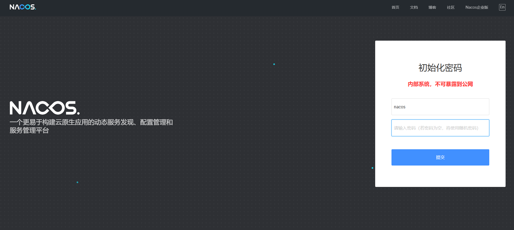

# Nacos

Nacos（"Dynamic Naming and Configuration Service"）是一个开源的动态服务发现、配置管理和服务管理平台，主要用于云原生应用和微服务架构中。它由阿里巴巴开源，旨在帮助开发者构建灵活、高可用的分布式系统。

Nacos通常与微服务架构中的其他组件一起使用，像是 Spring Cloud、Dubbo 等，成为分布式系统中服务治理和配置管理的重要一环。

- [官方文档](https://nacos.io/docs/v2.4/overview/)
- [GitHub](https://github.com/alibaba/nacos)


**下载镜像**

```
docker pull nacos/nacos-server:v2.4.3
```

**推送到仓库**

```
docker tag nacos/nacos-server:v2.4.3 registry.lingo.local/service/nacos-server:v2.4.3
docker push registry.lingo.local/service/nacos-server:v2.4.3
```

**保存镜像**

```
docker save registry.lingo.local/service/nacos-server:v2.4.3 | gzip -c > image-nacos-server_v2.4.3.tar.gz
```

**创建目录**

```
sudo mkdir -p /data/container/nacos/{data,logs}
```

**运行服务**

client-port8848映射的端口需要和client-rpc映射的端口保持：client-port+1000=client-rpc

```
docker run -d --name ateng-nacos \
  -p 20027:8848 -p 21027:9848 --restart=always \
  -v /data/container/nacos/data:/home/nacos/data \
  -v /data/container/nacos/logs:/home/nacos/logs \
  -e MODE=standalone \
  -e NACOS_AUTH_ENABLE=true \
  -e NACOS_AUTH_IDENTITY_KEY=ateng \
  -e NACOS_AUTH_IDENTITY_VALUE=kongyu \
  -e NACOS_AUTH_TOKEN=SGVsbG9Xb3JsZC1NeU5hbWVLb25neXUtQWx3YXlzU3RheVBvc2l0aXZl \
  -e NACOS_AUTH_TOKEN_EXPIRE_SECONDS=86400 \
  -e JVM_XMS=2g \
  -e JVM_XMX=2g \
  -e TZ=Asia/Shanghai \
  registry.lingo.local/service/nacos-server:v2.4.3
```

**查看日志**

```
docker logs -f ateng-nacos
```

**使用服务**

```
URL：http://192.168.1.12:20027/nacos
Username: nacos
Password: Admin@123
```

输入自定义密码



**删除服务**

停止服务

```
docker stop ateng-nacos
```

删除服务

```
docker rm ateng-nacos
```

删除目录

```
sudo rm -rf /data/container/nacos
```

