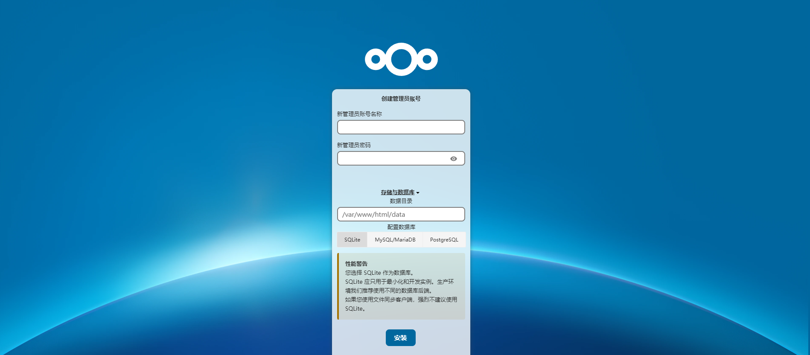
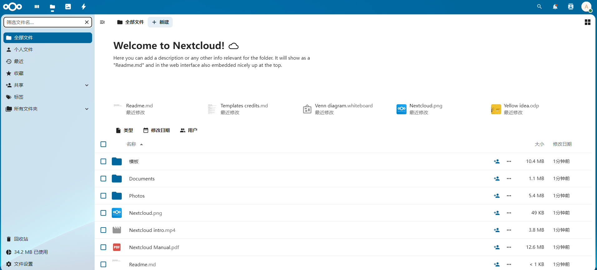

# Nextcloud

Nextcloud 是一个开源的私有云存储平台，用户可以自行搭建服务器，实现文件同步、共享、协作和备份等功能。它支持多种客户端（Web、桌面、移动端），可扩展性强，拥有丰富的插件生态，如日历、任务、聊天等，适用于个人和企业数据的安全管理。

- [官网链接](https://nextcloud.com/)
- [Github](https://github.com/nextcloud/server)

**服务依赖**

- 需要 [MySQL](/work/docker/service/mysql/) 或者 [PostgreSQL](/work/docker/service/mysql/)

**下载镜像**

```
docker pull nextcloud:31.0.4
```

**推送到仓库**

```
docker tag nextcloud:31.0.4 registry.lingo.local/service/nextcloud:31.0.4
docker push registry.lingo.local/service/nextcloud:31.0.4
```

**保存镜像**

```
docker save registry.lingo.local/service/nextcloud:31.0.4 | gzip -c > image-nextcloud_31.0.4.tar.gz
```

**创建目录**

```
sudo mkdir -p /data/container/nextcloud
```

**运行服务**

```
docker run -d --name ateng-nextcloud \
  -p 20029:80 --restart=always \
  -v /data/container/nextcloud:/var/www/html  \
  registry.lingo.local/service/nextcloud:31.0.4
```

**查看日志**

```
docker logs -f ateng-nextcloud
```

**使用服务**

```
URL: http://192.168.1.12:20029
```





**删除服务**

停止服务

```
docker stop ateng-nextcloud
```

删除服务

```
docker rm ateng-nextcloud
```

删除目录

```
sudo rm -rf /data/container/nextcloud
```

