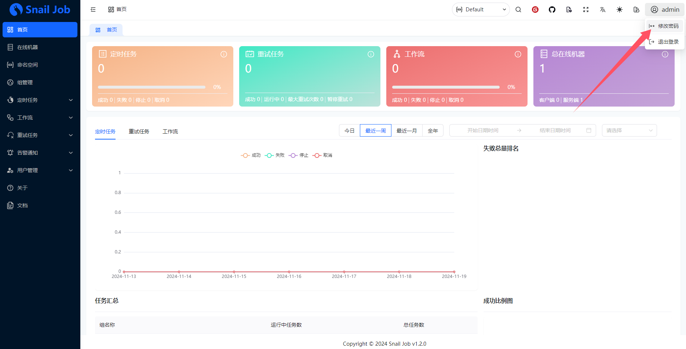

# Snail Job

🚀 灵活，可靠和快速的分布式任务重试和分布式任务调度平台

参考链接：

- [官网](https://snailjob.opensnail.com/)
- [DockerHub](https://hub.docker.com/r/opensnail/snail-job)

- [服务部署](https://snailjob.opensnail.com/docs/guide/server/service_deployment.html)


**下载SQL**

- MySQL：https://gitee.com/aizuda/snail-job/raw/vsj1.4.0/doc/sql/snail_job_mysql.sql
- PostgreSQL：https://gitee.com/aizuda/snail-job/raw/vsj1.4.0/doc/sql/snail_job_postgre.sql
- 更多sql下载地址：https://gitee.com/aizuda/snail-job/tree/vsj1.4.0/doc/sql

```bash
curl -o snail_job_mysql.sql https://gitee.com/aizuda/snail-job/raw/vsj1.4.0/doc/sql/snail_job_mysql.sql
curl -o snail_job_postgre.sql https://gitee.com/aizuda/snail-job/raw/vsj1.4.0/doc/sql/snail_job_postgre.sql
```

**导入SQL**

将下载后的SQL导入到对应的数据库中

- PostgreSQL

```
export PGPASSWORD=Admin@123
psql --host 192.168.1.12 -U postgres -d postgres -p 32297
CREATE USER snail_job WITH PASSWORD 'Admin@123';
CREATE DATABASE ateng_snail_job OWNER snail_job;
psql --host 192.168.1.12 -U snail_job -d ateng_snail_job -p 32297 -f snail_job_postgre.sql
```

- MySQL

```
export MYSQL_PWD=Admin@123
mysql -h192.168.1.13 -P20001 -uroot
CREATE DATABASE ateng_snail_job;
CREATE USER 'snail_job'@'%' IDENTIFIED BY 'Admin@123';
GRANT ALL PRIVILEGES ON ateng_snail_job.* TO 'snail_job'@'%';
FLUSH PRIVILEGES;
mysql -h192.168.1.12 -P32297 -usnail_job -pAdmin@123 ateng_snail_job < snail_job_mysql.sql
```

**下载镜像**

```
docker pull opensnail/snail-job:1.4.0
```

**推送到仓库**

```
docker tag opensnail/snail-job:1.4.0 registry.lingo.local/service/snail-job:1.4.0
docker push registry.lingo.local/service/snail-job:1.4.0
```

**保存镜像**

```
docker save registry.lingo.local/service/snail-job:1.4.0 | gzip -c > image-snail-job_1.4.0.tar.gz
```

**创建目录**

```
sudo mkdir -p /data/container/snail-job/{config,data}
```

**创建配置文件**

```
sudo tee /data/container/snail-job/config/application-extra.yml <<EOF
server:
  port: 8080
spring:
  datasource:
    ## postgres
    driver-class-name: org.postgresql.Driver
    url: jdbc:postgresql://192.168.1.10:32297/ateng_snail_job?useUnicode=true&characterEncoding=utf8&useSSL=true&autoReconnect=true&reWriteBatchedInserts=true
    ## mysql
    #driver-class-name: com.mysql.cj.jdbc.Driver
    #url: jdbc:mysql://192.168.1.10:32297/ateng_snail_job?useSSL=false&characterEncoding=utf8&useUnicode=true
    username: postgres
    password: Lingo@local_postgresql_5432
    type: com.zaxxer.hikari.HikariDataSource
    hikari:
      connection-timeout: 30000
      minimum-idle: 5
      maximum-pool-size: 20
      auto-commit: true
      idle-timeout: 30000
      pool-name: snail_job
      max-lifetime: 1800000
snail-job:
  retry-pull-page-size: 1000
  job-pull-page-size: 1000
  server-port: 17888
  log-storage: 7
  rpc-type: grpc
EOF
```

**运行服务**

```
docker run -d --name ateng-snail-job \
  -p 20025:8080 -p 20026:17888 --restart=always \
  -v /data/container/snail-job/config/application-extra.yml:/snailjob/server/application-extra.yml:ro \
  -v /data/container/snail-job/data:/snailjob/server/data \
  --entrypoint java \
  registry.lingo.local/service/snail-job:1.4.0 \
  -server -Xms512m -Xmx2048m \
  -jar app.jar \
  --spring.config.additional-location=application-extra.yml
```

**查看日志**

```
docker logs -f ateng-snail-job
```

**使用服务**

```
grpc: 192.168.1.12:20026
URL: http://192.168.1.12:20025/snail-job/
Username: admin
Password: admin
```

进入后输入初始的账号密码，然后再修改




**删除服务**

停止服务

```
docker stop ateng-snail-job
```

删除服务

```
docker rm ateng-snail-job
```

删除数据目录

```
sudo rm -rf /data/container/snail-job
```

