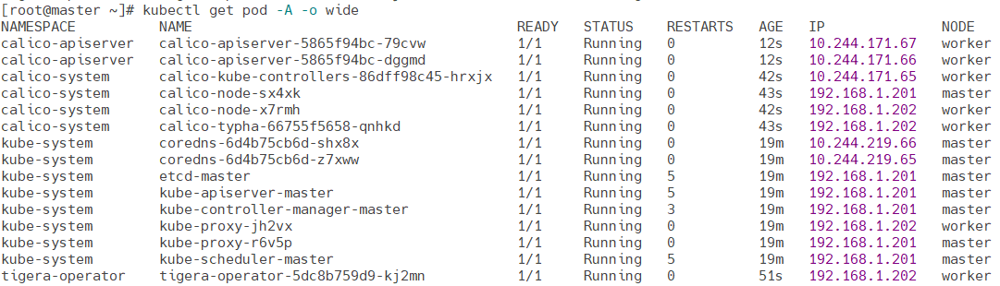
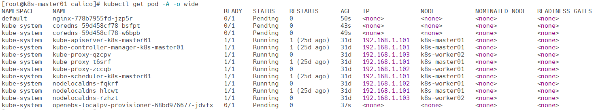

# Calico

Calico 是 Kubernetes 中广泛使用的网络插件，提供高性能的容器网络解决方案。它通过基于 IP 的路由机制实现 Pod 间通信，支持多种模式，如 IPIP（IP in IP）、VXLAN 和直接路由。IPIP 模式用于跨节点通信，将 Pod 流量封装在额外的 IP 层中，解决不同子网间的连通性问题。Calico 还支持网络策略来控制流量的访问，能够集成 Linux 内核的路由功能，适用于多云和混合云环境中的 Kubernetes 集群网络管理。

https://docs.tigera.io/calico/latest/getting-started/kubernetes/helm

**下载chart**

```
wget https://github.com/projectcalico/calico/releases/download/v3.28.2/tigera-operator-v3.28.2.tgz
```

**修改配置**

修改podCidr，需要和k8s初始化指定的值保持一致

```
kubectl get configmap kubeadm-config -n kube-system -o jsonpath='{.data.ClusterConfiguration}' | grep -E 'podSubnet|serviceSubnet'
```

values-ipip.yaml 和 values-vxlan.yaml是修改后的配置，可以根据环境做出适当修改

```
cat values-ipip.yaml
```

**创建服务**

以下两种模式任选一种即可

- IPIP模式

IPIP 模式是一种使用 IP-in-IP 封装来实现跨节点的 Pod 通信的方式，当底层网络不支持直接的三层互通时，通过 IPIP 隧道实现跨节点的 Pod 网络通信。

```
helm install calico --create-namespace -n tigera-operator -f values-ipip.yaml tigera-operator-v3.28.2.tgz
```

- VxLAN模式

VXLAN 是一种 Layer 2 隧道技术，与 IPIP 模式类似，适合跨节点不互通的场景。VXLAN 模式可为每个 Pod 创建一个虚拟二层网络，以实现跨节点的 Pod 通信。

```
helm install calico --create-namespace -n tigera-operator -f values-vxlan.yaml tigera-operator-v3.28.2.tgz
```

**查看服务**

```
kubectl get pods --all-namespaces | grep -E "^(tigera-operator|calico-system|calico-apiserver)"
kubectl logs -f -n calico-system deploy/calico-kube-controllers
```

**查看应用**

```
kubectl get pod -A -o wide
```



**使用calicoctl**

下载并安装

```
wget https://github.com/projectcalico/calico/releases/download/v3.28.2/calicoctl-linux-amd64
chmod +x calicoctl-linux-amd64
cp calicoctl-linux-amd64 /usr/local/bin/calicoctl
```

配置环境变量

```
cat >> ~/.bash_profile <<EOF
## CALICO
export CALICO_DATASTORE_TYPE=kubernetes
export CALICO_KUBECONFIG=~/.kube/config
EOF
source ~/.bash_profile
```

查看节点的详细信息

```
# calicoctl get nodes -o wide
NAME           ASN       IPV4               IPV6
k8s-master01   (64512)   192.168.1.101/24
k8s-worker01   (64512)   192.168.1.102/24
k8s-worker02   (64512)   192.168.1.103/24
```

查看 IP 地址池的详细信息

```
# calicoctl get ipPool -o wide
NAME                  CIDR            NAT    IPIPMODE      VXLANMODE   DISABLED   DISABLEBGPEXPORT   SELECTOR
default-ipv4-ippool   10.100.0.0/16   true   CrossSubnet   Never       false      false              all()
```

显示 IP 地址管理的详细信息

```
# calicoctl ipam show --show-blocks
+----------+-----------------+-----------+------------+--------------+
| GROUPING |      CIDR       | IPS TOTAL | IPS IN USE |   IPS FREE   |
+----------+-----------------+-----------+------------+--------------+
| IP Pool  | 10.100.0.0/16   |     65536 | 29 (0%)    | 65507 (100%) |
| Block    | 10.100.130.0/24 |       256 | 6 (2%)     | 250 (98%)    |
| Block    | 10.100.181.0/24 |       256 | 12 (5%)    | 244 (95%)    |
| Block    | 10.100.61.0/24  |       256 | 11 (4%)    | 245 (96%)    |
+----------+-----------------+-----------+------------+--------------+
```

**删除服务以及数据**

删除tigera

```
helm uninstall calico -n tigera-operator
```

删除Calico相关的文件

> 所有节点

```
rm -rf /var/lib/cni/
rm -f /etc/cni/net.d/{10-calico.conflist,calico-kubeconfig}
rm -rf /var/lib/calico/
```

卸载内核模块

> 所有节点

```
modprobe -r ipip vxlan
```

删除网络设备

> 所有节点

```
for net in $(ifconfig | egrep "tunl|vxlan.calico|cali" | awk -F: '{print $1}');do ifconfig $net down && ip link delete $net;done
```

重启kubelet

> 在卸载 Calico 之后，**所有节点**建议重启 `kubelet` 服务和网络服务，以确保 Kubernetes 节点恢复到正常的网络状态

```
systemctl restart kubelet
```

查看pod状态

```
kubectl get pod -A -o wide
```

