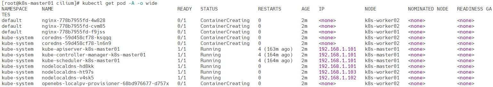

# Cilium

Cilium 是一个基于 eBPF 技术的网络和安全工具，用于在 Kubernetes 集群中提供高效、可扩展的网络连接和安全策略。Cilium 能够为微服务和容器提供透明的网络流量控制、负载均衡、以及网络安全策略。它使用 eBPF（Extended Berkeley Packet Filter）直接在 Linux 内核中运行，实现了低延迟、高性能的网络处理，适用于大规模云原生环境。

Cilium 的官网地址是：[https://cilium.io/](https://cilium.io/)

## 基础配置

**要求：**

- Kubernetes 必须配置为使用 CNI（请参阅[网络插件要求](https://kubernetes.io/docs/concepts/extend-kubernetes/compute-storage-net/network-plugins/#network-plugin-requirements)）
- Linux 内核 >= 5.4

**查看版本**

```
helm repo add cilium https://helm.cilium.io/
helm search repo cilium/cilium -l
```

**下载chart**

```
helm pull cilium/cilium --version 1.16.3
```

**修改配置**

根据环境做出相应的修改

```
cat values.yaml
```

**删除kube-proxy**

```
kubectl get -n kube-system daemonsets.apps kube-proxy -oyaml > kube-proxy.yaml
kubectl delete -n kube-system daemonsets.apps kube-proxy
```

## 创建服务

**创建服务**

以下模式任选其一即可

- VxLAN模式

使用 VXLAN 隧道实现网络隔离和跨主机的容器通信，适合集群内各节点间需要私有网络的环境。

```
helm install cilium -n kube-system -f values-vxlan.yaml cilium-1.16.3.tgz
```

- Native Routing模式

直连路由模式通过节点的路由表实现跨主机的容器通信，减少了隧道开销，适合低延迟、高性能的场景。

```
helm install cilium -n kube-system -f values-directrouting.yaml cilium-1.16.3.tgz
```

**查看服务**

```
kubectl get -n kube-system pod -l app.kubernetes.io/part-of=cilium
kubectl -n kube-system logs -f daemonsets/cilium
```

**查看应用**

应用IP分配正常且运行正常，外部服务访问正常说明网络服务安装正常。

```
kubectl get pod -A -o wide
```

## 使用服务

**使用服务**

进入cilium容器

```
kubectl exec -it -n kube-system \
  $(kubectl get pod -n kube-system -l k8s-app=cilium -o jsonpath='{.items[0].metadata.name}') -- bash
```

查看节点列表

```
cilium node list
```

查看服务列表

```
cilium service list
```

查看 IP 地址列表

```
cilium ip list
```

查看 Endpoint 列表

```
cilium endpoint list
```

实时监控流量

```
cilium monitor
```

查看网络策略

```
cilium policy get
```

查看隧道接口信息

```
cilium bpf tunnel list
```

## 删除服务

**删除服务以及数据**

删除相关的资源

```
helm uninstall -n kube-system cilium
```

删除相关规则

> 所有节点

```
iptables -P INPUT ACCEPT
iptables -P OUTPUT ACCEPT
iptables -F
iptables -X
iptables -Z
```

删除相关内核

> 所有节点

```
sudo docker run -it -v /run/cilium/cgroupv2/:/run/cilium/cgroupv2/ -v /sys/fs/bpf:/sys/fs/bpf -v /sys/fs/cgroup/:/sys/fs/cgroup/ --privileged --net=host registry.lingo.local/kubernetes/cilium:v1.16.3 cilium  post-uninstall-cleanup -f --all-state
```

删除相关的文件

> 所有节点

```
rm -f /etc/cni/net.d/05-cilium.conflist
```

删除网络设备

> 所有节点

```
for net in $(ifconfig | egrep "lxc|cilium|dumm|ipvs|veth" | awk -F: '{print $1}');do ifconfig $net down && ip link delete $net;done
```

重启kubelet

> 所有节点

```
systemctl restart kubelet
```

重启所有pod

```
kubectl delete pod --all --all-namespaces
```

查看pod状态

```
kubectl get pod -A -o wide
```



重启操作系统

> 所有节点

```
reboot
```

