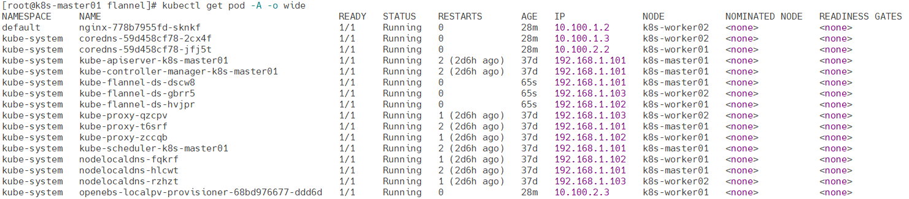

# Flannel

Flannel 是 Kubernetes 中广泛使用的网络插件，通过为每个节点分配独立子网来实现 Pod 的跨节点通信。它支持多种模式，包括 VXLAN 隧道、Host-GW 和 UDP 等，以适应不同网络环境需求。Flannel 设计简单、易于部署，主要适用于对性能要求适中、规模不大的集群场景。相较于其他插件（如 Calico 或 Cilium），Flannel 不支持高级网络策略，但在提供基本网络连通性上表现稳定可靠，是轻量级集群的理想选择。

https://github.com/flannel-io/flannel

**下载chart**

```
wget https://github.com/flannel-io/flannel/releases/download/v0.26.0/flannel.tgz
```

**修改配置**

修改podCidr，需要和k8s初始化指定的值保持一致

```
kubectl get configmap kubeadm-config -n kube-system -o jsonpath='{.data.ClusterConfiguration}' | grep -E 'podSubnet|serviceSubnet'
```

values.yaml是修改后的配置，可以根据环境做出适当修改

```
cat values.yaml
```

**创建服务**

```
helm install flannel -n kube-system -f values.yaml flannel.tgz
```

**查看服务**

```
kubectl get pods -n kube-system -l app=flannel
kubectl -n kube-system logs -f daemonsets/kube-flannel-ds
```

**查看应用**

```
kubectl get pod -A -o wide
```



**删除服务以及数据**

删除相关的资源

```
helm uninstall flannel -n kube-system
```

删除相关的文件

> 所有节点

```
rm -rf /var/lib/cni/ /run/flannel /run/xtables.lock
rm -f /etc/cni/net.d/10-flannel.conflist
```

删除网络设备

> 所有节点

```
for net in $(ifconfig | egrep "tunl|cni|flannel|veth" | awk -F: '{print $1}');do ifconfig $net down && ip link delete $net;done
```

重启kubelet

> 所有节点

```
systemctl restart kubelet
```

重启所有pod

```
kubectl delete pod --all --all-namespaces
```

查看pod状态

```
kubectl get pod -A -o wide
```

