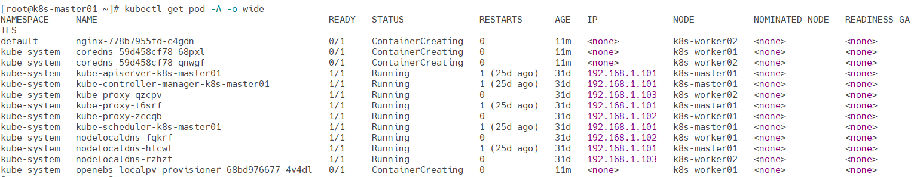
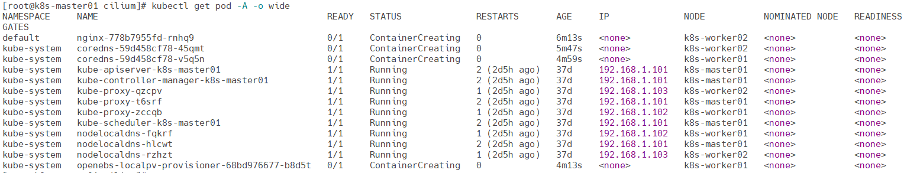
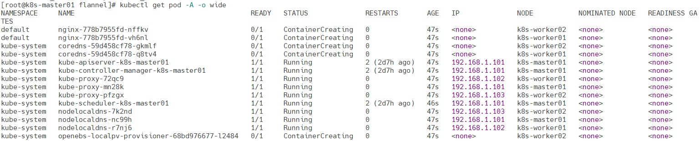

# 卸载网络组件


## Kubekey安装的Calico

删除Calico相关的资源

```
kubectl delete -n kube-system daemonsets.apps calico-node
kubectl delete -n kube-system deployments.apps calico-kube-controllers
kubectl get crds | grep 'calico' | awk '{print $1}' | xargs kubectl delete crd
```

删除Calico相关的文件

> 所有节点

```
rm -rf /var/lib/cni/
rm -f /etc/cni/net.d/{10-calico.conflist,calico-kubeconfig}
rm -rf /var/lib/calico/
```

卸载内核模块

> 所有节点

```
modprobe -r ipip vxlan
```

删除网络设备

> 所有节点

```
for net in $(ifconfig | egrep "tunl|vxlan.calico|cali" | awk -F: '{print $1}');do ifconfig $net down && ip link delete $net;done
```

重启kubelet

> 在卸载 Calico 之后，**所有节点**建议重启 `kubelet` 服务和网络服务，以确保 Kubernetes 节点恢复到正常的网络状态

```
systemctl restart kubelet
```

查看pod状态

```
kubectl get pod -A -o wide
```




## Helm安装的Calico

删除Calico相关的资源

```
helm uninstall calico -n tigera-operator
```

删除Calico相关的文件

> 所有节点

```
rm -rf /var/lib/cni/
rm -f /etc/cni/net.d/{10-calico.conflist,calico-kubeconfig}
rm -rf /var/lib/calico/
```

卸载内核模块

> 所有节点

```
modprobe -r ipip vxlan
```

删除网络设备

> 所有节点

```
for net in $(ifconfig | egrep "tunl|vxlan.calico|cali" | awk -F: '{print $1}');do ifconfig $net down && ip link delete $net;done
```

重启kubelet

> 在卸载 Calico 之后，**所有节点**建议重启 `kubelet` 服务和网络服务，以确保 Kubernetes 节点恢复到正常的网络状态

```
systemctl restart kubelet
```

查看pod状态

```
kubectl get pod -A -o wide
```


## Helm安装的Cilium

删除相关的资源

```
helm uninstall -n kube-system cilium
```

删除相关内核

> 所有节点

```
sudo docker run --rm \
  -v /run/cilium/cgroupv2/:/run/cilium/cgroupv2/ \
  -v /sys/fs/bpf:/sys/fs/bpf \
  -v /sys/fs/cgroup/:/sys/fs/cgroup/ \
  --privileged --net=host \
  registry.lingo.local/kubernetes/cilium:v1.16.3 \
  cilium post-uninstall-cleanup -f --all-state
```

卸载 cgroup 文件系统

> 所有节点

```
umount /var/run/cilium/cgroupv2
rm -rf /var/run/cilium
```

删除相关的文件

> 所有节点

```
rm -f /etc/cni/net.d/05-cilium.conflist
rm -f /opt/cni/bin/{cilium-cni,loopback}
```

卸载内核模块

> 所有节点

```
modprobe -r vxlan
```

删除网络设备

> 所有节点

```
for net in $(ifconfig | egrep "lxc|cilium|dumm|veth" | awk -F: '{print $1}');do ifconfig $net down && ip link delete $net;done
```

重启kubelet

> 在卸载服务之后，**所有节点**建议重启 `kubelet` 服务和网络服务，以确保 Kubernetes 节点恢复到正常的网络状态

```
systemctl restart kubelet
```

查看pod状态

```
kubectl get pod -A -o wide
```




## Helm安装的Flannel

删除相关的资源

```
helm uninstall flannel -n kube-system
```

删除相关的文件

> 所有节点

```
rm -rf /var/lib/cni/
rm -f /etc/cni/net.d/10-flannel.conflist /opt/cni/bin/flannel
```

卸载内核模块

> 所有节点

```
modprobe -r vxlan
```

删除网络设备

> 所有节点

```
for net in $(ifconfig | egrep "tunl|cni|flannel|veth" | awk -F: '{print $1}');do ifconfig $net down && ip link delete $net;done
```

重启kubelet

> 在卸载服务之后，**所有节点**建议重启 `kubelet` 服务和网络服务，以确保 Kubernetes 节点恢复到正常的网络状态

```
systemctl restart kubelet
```

查看pod状态

```
kubectl get pod -A -o wide
```



