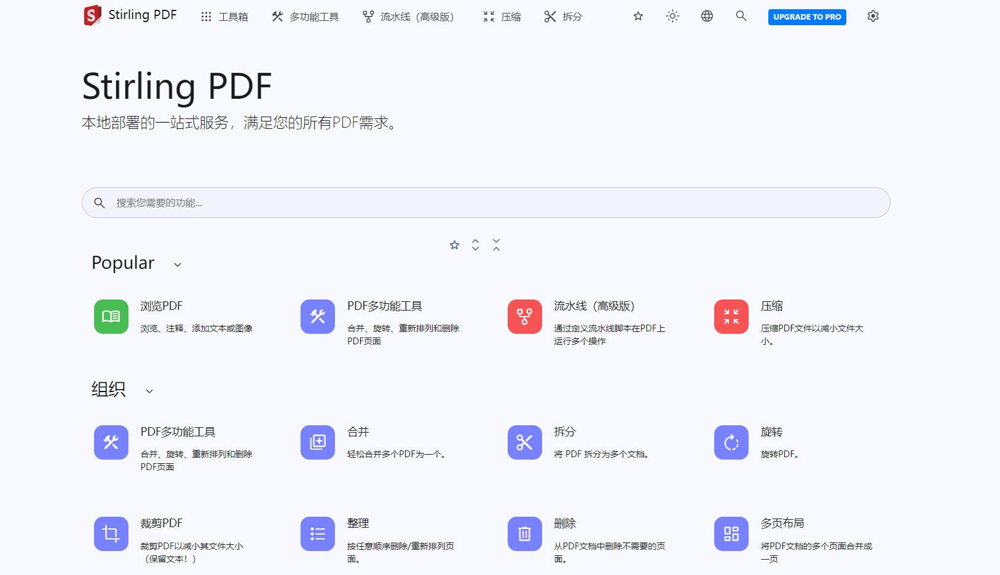

# Stirling-PDF

本地托管的web应用程序，允许您对PDF文件执行各种操作

- [官方文档](https://www.stirlingpdf.com/)

**配置修改**

- 认证配置：spec.template.spec.containers[0].env[*]
- 存储类：spec.volumeClaimTemplates[0].spec.storageClassName
- 镜像地址：spec.template.spec.containers[0].image
- 其他：其他配置按照具体环境修改

**添加节点标签**

创建标签，运行在标签节点上

```
kubectl label nodes server03.lingo.local kubernetes.service/stirling-pdf="true"
```

**创建服务**

```
kubectl apply -n kongyu -f deploy.yaml
```

**查看服务**

```
kubectl get -n kongyu pod,svc,pvc -l app=stirling-pdf
kubectl logs -n kongyu -f --tail=100 stirling-pdf-0
```

**访问服务**

```
Address: http://192.168.1.10:25090
Username: admin
Password: Admin@123
```



**删除服务**

```
kubectl delete -n kongyu -f deploy.yaml
kubectl delete -n kongyu pvc -l app=stirling-pdf
```


