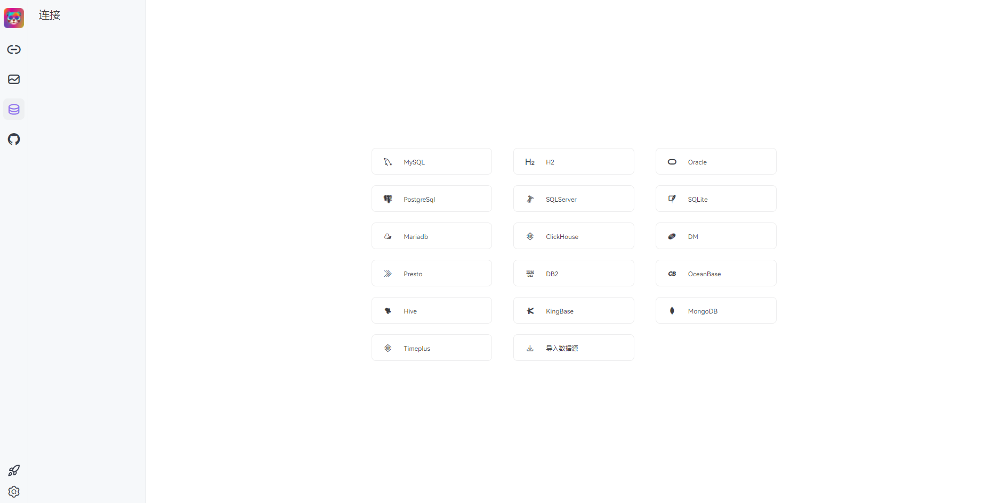

# Chat2DB

Chat2DB 是一款专为现代数据驱动型企业打造的数据库管理、数据开发及数据分析工具。作为一款AI原生的产品，Chat2DB 将人工智能技术与传统数据库管理功能深度融合，旨在提供更为智能、便捷的工作体验，助力用户高效地管理数据库、开展数据开发和分析工作。

参考链接：

- [官网](https://chat2db-ai.com/resources/docs/start-guide/getting-started)
- [Github](https://github.com/CodePhiliaX/Chat2DB)


**自定义配置**

修改deploy.yaml配置文件

- 配置文件修改：ConfigMap中的application.yml根据实际需求修改
- 资源配置：Deployment中的resources和args中的相关参数


- 其他：其他配置按照具体环境修改

**添加节点标签**

创建标签，运行在标签节点上

```
kubectl label nodes server03.lingo.local kubernetes.service/chat2db="true"
```

**创建服务**

```
kubectl apply -n kongyu -f deploy.yaml
```

**查看服务**

```
kubectl get -n kongyu pod,svc,pvc -l app=chat2db
```

**查看日志**

```
kubectl logs -n kongyu -f --tail=100 chat2db-0
```

**访问服务**

```
URL: http://192.168.1.10:30824/
Username: chat2db
Password: chat2db
```



**驱动下载**

进入[Maven中央仓库](https://central.sonatype.com/)，下载驱动包

- [MySQL](https://central.sonatype.com/artifact/com.mysql/mysql-connector-j/versions)
- [PostgreSQL](https://central.sonatype.com/artifact/org.postgresql/postgresql/versions)

**删除服务**

```
kubectl delete -n kongyu -f deploy.yaml
```

