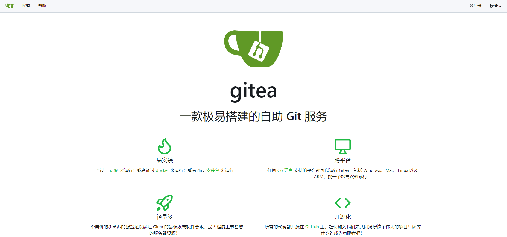

# Gitea

Gitea 是一个轻量级、开源的 Git 代码托管平台，提供类似 GitHub 的功能，如代码托管、版本控制、问题追踪和持续集成等。它易于安装和自托管，适合个人和小型团队使用。Gitea 支持多种语言，具有简洁的界面和高性能的特点。

- [官网链接](https://about.gitea.com/)

**查看版本**

```
helm search repo bitnami/gitea -l
```

**下载chart**

```
helm pull bitnami/gitea --version 3.0.2
```

**修改配置**

values.yaml是修改后的配置，可以根据环境做出适当修改

- 存储类：defaultStorageClass（不填为默认）
- 认证配置：adminUsername adminPassword
- PostgreSQL信息：externalDatabase.*
- 镜像地址：image.registry
- 其他配置：...

```
cat values.yaml
```

**创建标签，运行在标签节点上**

```
kubectl label nodes server03.lingo.local kubernetes.service/gitea="true"
```

**创建服务**

```shell
helm install gitea -n kongyu -f values.yaml gitea-3.0.2.tgz
```

**查看服务**

```
kubectl get -n kongyu pod,svc,pvc -l app.kubernetes.io/instance=gitea
kubectl logs -f -n kongyu -l app.kubernetes.io/instance=gitea
```

**使用服务**

服务是80为HTTP端口，22为SSH端口

```
[HTTP]
Address: http://192.168.1.10:37600/
Username: root
Password: Admin@123
[SSH]
Address: ssh://git@192.168.1.10:30721
```



**删除服务以及数据**

```
helm uninstall -n kongyu gitea
```

