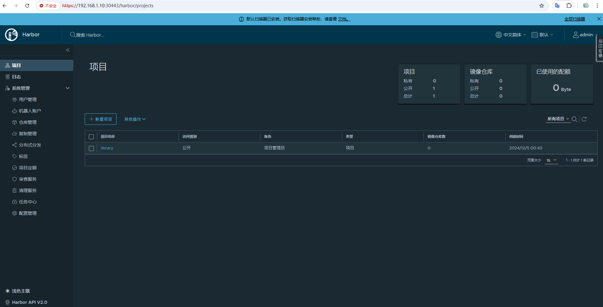

# Harbor

Harbor 是一个开源的企业级容器镜像仓库，旨在帮助用户管理和安全地存储 Docker 镜像和 Helm charts。它提供镜像仓库管理、权限控制、镜像扫描、日志审计等功能，支持高可用性和分布式部署，适用于 DevOps 和 CI/CD 环境。Harbor 提供 Web UI 和 CLI 工具，支持与 LDAP、Active Directory 集成，确保镜像管理的安全性和效率。

- [官网链接](https://goharbor.io/)

**查看版本**

```
helm search repo bitnami/harbor -l
```

**下载chart**

```
helm pull bitnami/harbor --version 24.0.2
```

**创建证书**

- 参考 `cert/README.md` 创建证书

**修改配置**

values.yaml是修改后的配置，可以根据环境做出适当修改

- 存储类：defaultStorageClass（不填为默认）
- 镜像地址：image.registry
- 认证配置：adminPassword
- 访问地址：externalURL 需要和 service.nodePorts.https 的端口保持一致，IP使用集群节点的IP，使用的是本地创建的证书
- 证书配置：
    - internalTLS.caBundleSecret
    - ingress.core.hostname
    - nginx.tls.existingSecret nginx.tls.commonName

- 存储配置：根据需求调整persistence.persistentVolumeClaim.*.size的值
- 其他配置：...

```
cat values.yaml
```

**创建服务**

```
helm install harbor -n harbor --create-namespace -f values.yaml harbor-24.0.2.tgz
```

**查看服务**

```
kubectl get -n harbor pod,svc,pvc,ingress -l app.kubernetes.io/instance=harbor
```

**使用服务**

访问Web

```
URL: https://192.168.1.10:30443/
Username: admin
Password: Admin@123
```



登录仓库

```
# docker login -u admin 192.168.1.10:30443
Password:
WARNING! Your password will be stored unencrypted in /root/.docker/config.json.
Configure a credential helper to remove this warning. See
https://docs.docker.com/engine/reference/commandline/login/#credentials-store

Login Succeeded
```

推送镜像

```
docker pull nginx
docker tag nginx 192.168.1.10:30443/library/nginx:latest
docker push 192.168.1.10:30443/library/nginx:latest
```

**删除服务以及数据**

```
helm uninstall -n harbor harbor
kubectl delete -n harbor pvc -l app.kubernetes.io/instance=harbor
kubectl delete ns harbor
```

