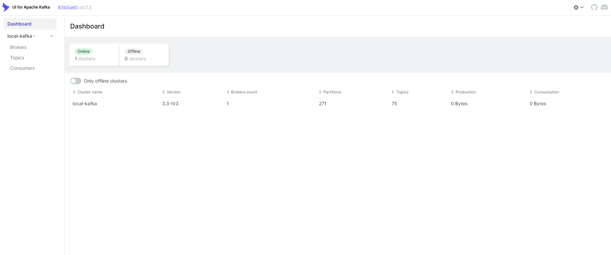

# Kafka UI

用于管理 Apache Kafka® 集群的多功能、快速且轻量级的 Web UI。

- [官网链接](https://github.com/provectus/kafka-ui)

**下载chart**

```
wget https://github.com/provectus/kafka-ui-charts/archive/refs/tags/charts/kafka-ui-0.7.6.tar.gz
```

**打包chart**

```
tar -zxvf kafka-ui-0.7.6.tar.gz
helm package kafka-ui-charts-charts-kafka-ui-0.7.6/charts/kafka-ui/
```

**修改配置**

values.yaml是修改后的配置，可以根据环境做出适当修改

- kafka配置：可以填写多个，列表形式
    - yamlApplicationConfig.kafka.clusters[0].name
    - yamlApplicationConfig.kafka.clusters[0].bootstrapServers
- 镜像地址：image.registry
- 其他配置：...

```
cat values.yaml
```

**创建服务**

> 如果需要装插件，参考文件 `values-plugins.yaml`

```
helm install kafka-ui -n kongyu -f values.yaml kafka-ui-0.7.6.tgz
```

**查看服务**

```
kubectl get -n kongyu pod,svc -l app.kubernetes.io/instance=kafka-ui
kubectl logs -n kongyu -f -l app.kubernetes.io/instance=kafka-ui
```

**使用服务**

Web访问：http://192.168.1.10:32198/



**删除服务以及数据**

```
helm uninstall kafka-ui -n kongyu
```


