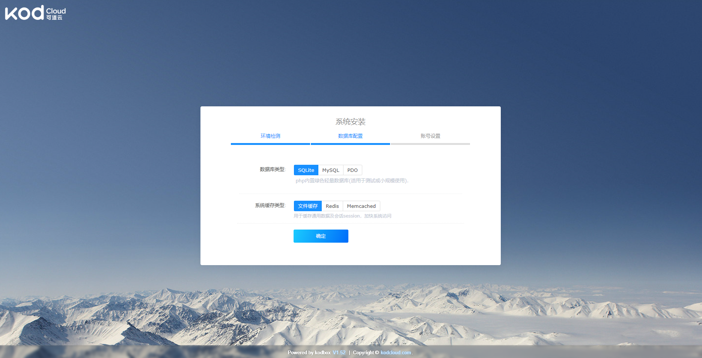
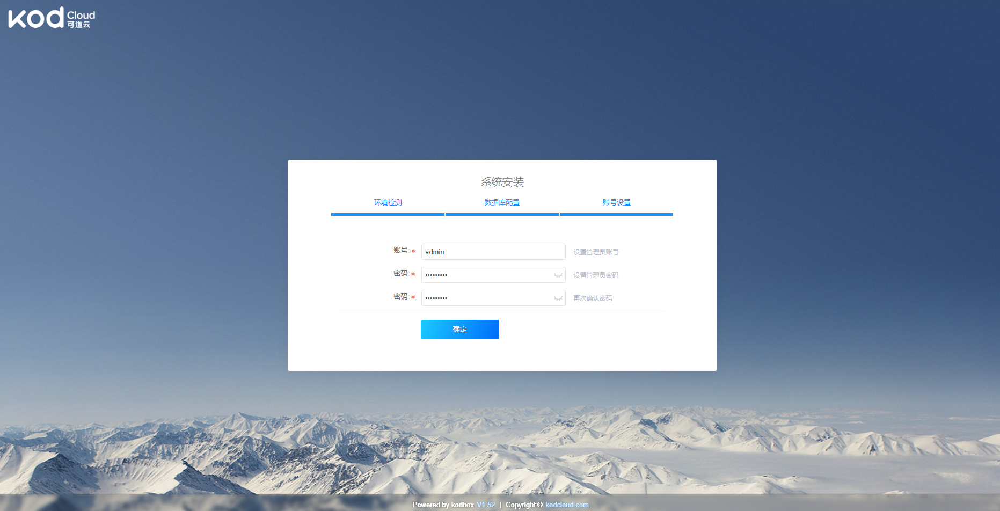

# 可道云网盘

`KodBox`是可道云推出的企业级私有云存储解决方案，旨在为中小企业提供安全可控、可靠易用的一站式在线文件存储管理与协同办公平台。

参考链接：

- [官网](https://docs.kodcloud.com/setup/docker/)
- [DockerHub](https://hub.docker.com/r/kodcloud/kodbox)


**自定义配置**

- 存储类：修改storageClassName名称


- 其他：其他配置按照具体环境修改

**创建服务**

> 如果需要使用外部数据库，参考 `deploy-db.yaml`

```
kubectl apply -n kongyu -f deploy.yaml
```

**查看服务**

```
kubectl get -n kongyu pod,pvc,svc -l app=kodbox
```

**查看日志**

```
kubectl logs -n kongyu -f --tail=100 kodbox-0
```

**查看服务端口**

```
kubectl get svc kodbox -n kongyu -o jsonpath='{.spec.ports[0].nodePort}'
```

**访问服务**

```
Address: http://192.168.1.10:8146
```

进入后提示输入初始化信息，输入名称和账号密码





**删除服务**

```
kubectl delete -n kongyu -f deploy.yaml
kubectl delete -n kongyu pvc -l app=kodbox
```


