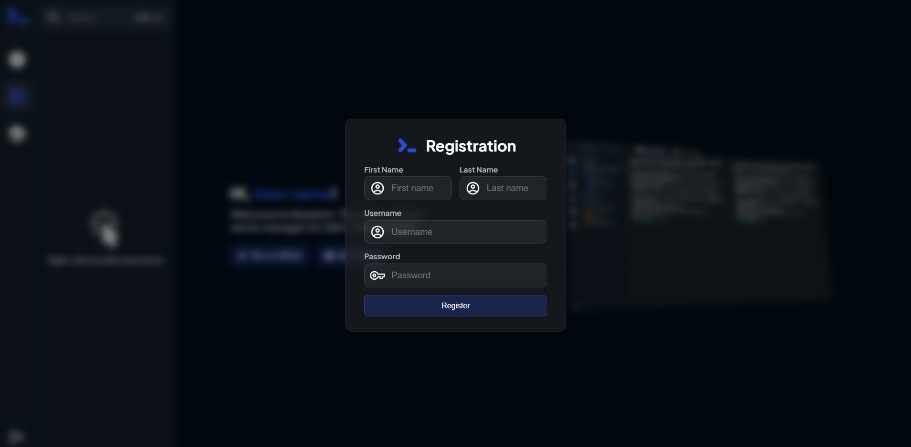

# Nexterm

是一款用于SSH，RDP，VNC免费的服务器远程管理平台。

Nexterm作为服务器管理软件，提供了便捷的方式来管理和连接远程服务器。它支持SSH、VNC和RDP等多种远程连接协议，使用户能够轻松访问和管理位于不同地点的服务器。

参考链接：

- [官网](https://github.com/gnmyt/Nexterm)
- [博客](https://mp.weixin.qq.com/s/RqHsZ1ifnjb0clG8mLqg2g)


**自定义配置**

- 存储类：修改storageClassName名称


- 其他：其他配置按照具体环境修改


**创建服务**

```
kubectl apply -n kongyu -f deploy.yaml
```

**查看服务**

```
kubectl get -n kongyu pod,pvc,svc -l app=nexterm
```

**查看日志**

```
kubectl logs -n kongyu -f --tail=100 nexterm-0
```

**查看服务端口**

```
kubectl get svc nexterm -n kongyu -o jsonpath='{.spec.ports[0].nodePort}'
```

**访问服务**

```
Address: http://192.168.1.10:24342
```

进入后提示输入初始化信息，输入名称和账号密码



**删除服务**

```
kubectl delete -n kongyu -f deploy.yaml
kubectl delete -n kongyu pvc -l app=nexterm
```


