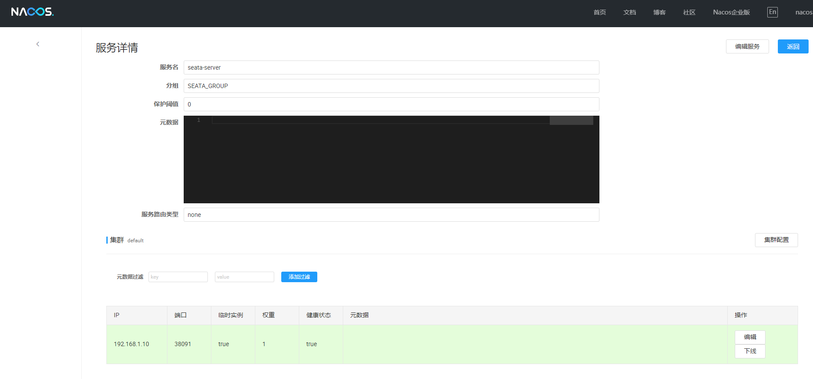

# Seata

Seata（Simple Extensible Autonomous Transaction Architecture）是一款开源的分布式事务解决方案，旨在解决微服务架构下的数据一致性问题。它提供了AT、TCC、SAGA和XA等多种事务模式，支持自动回滚和补偿机制。Seata通过事务协调器（TC）管理全局事务，确保各服务间的事务一致性。它易于集成，广泛兼容Spring Cloud、Dubbo等框架，是微服务环境中可靠的分布式事务解决方案。

- [官方文档](https://seata.apache.org/zh-cn/docs/overview/what-is-seata)
- [镜像构建](/work/kubernetes/service/seata/build/)


## 使用file

**自定义配置**

修改deploy.yaml配置文件

- 资源配置：resources相关参数
- 命令参数：根据实际情况修改java的相关参数


- 其他：其他配置按照具体环境修改

**创建标签，运行在标签节点上**

```
kubectl label nodes server03.lingo.local kubernetes.service/seata-server="true"
```

**创建服务**

```
kubectl apply -n kongyu -f deploy.yaml
```

**查看服务**

```
kubectl get -n kongyu pod,svc -l app=seata-server
```

**查看日志**

```
kubectl logs -n kongyu -f deploy/seata-server
```


## 使用Nacos+JDBC

**下载SQL**

将下载的SQL导入对应的数据库

- MySQL

URL: jdbc:mysql://192.168.1.10:35725/kongyu

```
curl -O https://raw.githubusercontent.com/apache/incubator-seata/refs/tags/v2.3.0/script/server/db/mysql.sql
```

- PostgreSQL

URL: jdbc:postgresql://192.168.1.10:32297/kongyu?currentSchema=public&stringtype=unspecified

```
curl -O https://raw.githubusercontent.com/apache/incubator-seata/refs/tags/v2.3.0/script/server/db/postgresql.sql
```

**自定义配置**

修改deploy.yaml配置文件

- 配置文件：ConfigMap，seata.config和seata.registry的Nacos信息；seata.store存储的数据库信息；Web控制台的账号密码console.user
- rpc端口：SEATA_IP和SEATA_PORT环境变量设置最终注册在Nacos的IP和端口，同时监听SEATA_PORT端口
- 堆内存：JVM_XMX和JVM_XMS环境变量，同步修改resources的limits和requests


- 其他：其他配置按照具体环境修改

**创建标签，运行在标签节点上**

```
kubectl label nodes server03.lingo.local kubernetes.service/seata-server="true"
```

**创建服务**

- MySQL

```
kubectl apply -n kongyu -f deploy-mysql.yaml
```

- PostgreSQL

```
kubectl apply -n kongyu -f deploy-postgresql.yaml
```

**查看服务**

```
kubectl get -n kongyu pod,svc -l app=seata-server
```

**查看日志**

```
kubectl logs -n kongyu -f deploy/seata-server
```

**访问服务**

Web控制台

```
URL: http://192.168.1.10:37091/
RPC: 192.168.1.10:38091
Username: admin
Password: Admin@123
```

Nacos查看服务



**删除服务**

```
kubectl delete -n kongyu -f deploy-mysql.yaml
```

