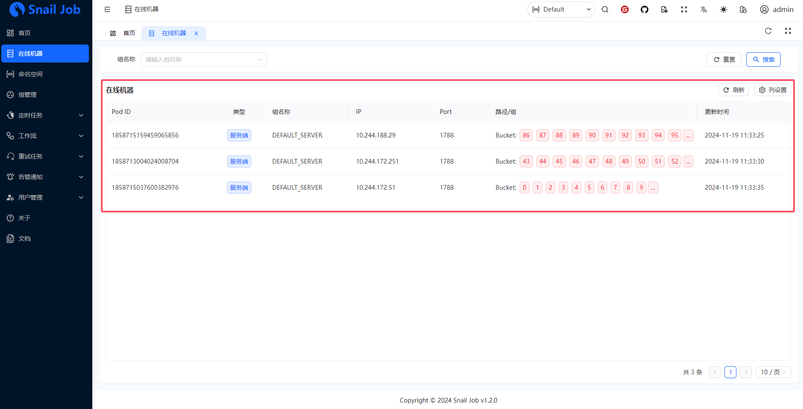

# Snail Job

🚀 灵活，可靠和快速的分布式任务重试和分布式任务调度平台

参考链接：

- [官网](https://snailjob.opensnail.com/)
- [DockerHub](https://hub.docker.com/r/opensnail/snail-job)

- [服务部署](https://snailjob.opensnail.com/docs/guide/server/service_deployment.html)


**下载SQL**

[更多sql下载地址](https://gitee.com/aizuda/snail-job/tree/vsj1.3.0/doc/sql)

- MySQL：https://gitee.com/aizuda/snail-job/raw/vsj1.3.0/doc/sql/snail_job_mysql.sql
- PostgreSQL：https://gitee.com/aizuda/snail-job/raw/vsj1.3.0/doc/sql/snail_job_postgre.sql

```bash
curl -o snail_job_mysql.sql https://gitee.com/aizuda/snail-job/raw/vsj1.3.0/doc/sql/snail_job_mysql.sql
curl -o snail_job_postgre.sql https://gitee.com/aizuda/snail-job/raw/vsj1.3.0/doc/sql/snail_job_postgre.sql
```

**导入SQL**

将下载后的SQL导入到对应的数据库中

**自定义配置**

修改deploy.yaml配置文件

- 数据库配置：修改环境变量PARAMS为实际的数据库信息


- 其他：其他配置按照具体环境修改

**添加节点标签**

创建标签，运行在标签节点上

```
kubectl label nodes server03.lingo.local kubernetes.service/snail-job="true"
```

**创建服务**

```
kubectl apply -n kongyu -f deploy.yaml
```

**查看服务**

```
kubectl get -n kongyu pod,svc -l app=snail-job
```

**查看日志**

```
kubectl logs -n kongyu -f --tail=100 deploy/snail-job
```

**访问服务**

```
grpc: 192.168.1.10:32682
URL: http://192.168.1.10:32681/snail-job/
Username: admin
Password: admin
```

进入后输入初始的账号密码，然后再修改


**高可用配置**

可以动态扩缩容来实现服务的高可用性

```
kubectl scale -n kongyu deployment snail-job --replicas=3
```



**删除服务**

```
kubectl delete -n kongyu -f deploy.yaml
```

