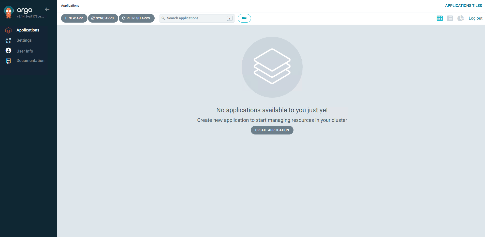

# Argo CD

Argo CD 是一个开源的 Kubernetes 原生持续交付（CD）工具，用于自动化管理和部署应用。它基于声明式配置，允许开发者通过 GitOps 工作流管理 Kubernetes 应用。Argo CD 监控 Git 仓库中的应用定义，自动将其同步到目标 Kubernetes 集群，确保应用状态与 Git 中的定义一致。它提供强大的 Web UI、CLI 和 API 支持，适合大规模、复杂环境下的持续交付需求。

- [官网链接](https://argo-cd.readthedocs.io/)


## 安装Argo CD

### helm安装

参考文档：[helm安装Argo CD](/work/kubernetes/service/argo-cd/v2.14.8/)


## 安装客户端命令

**下载客户端**

```
curl -O https://github.com/argoproj/argo-cd/releases/download/v2.14.9/argocd-linux-amd64
```

**安装客户端**

```
mv argocd-linux-amd64 /usr/bin/argocd
chmod +x /usr/bin/argocd
```

**查看版本**

```
$ argocd version
argocd: v2.14.9+38985bd
  BuildDate: 2025-04-02T19:55:21Z
  GitCommit: 38985bdcd6c3b031fb83757a1fb0c39a55bf6a24
  GitTreeState: clean
  GoVersion: go1.23.3
  Compiler: gc
  Platform: linux/amd64
FATA[0000] Argo CD server address unspecified 
```


## 登录Argo CD

### 获取登录信息

**获取Server的地址**

```
export NODE_PORT=$(kubectl get --namespace argocd -o jsonpath="{.spec.ports[?(@.port==443)].nodePort}" services argo-cd-server)
export NODE_IP=$(kubectl get nodes --namespace argocd -o jsonpath="{.items[0].status.addresses[0].address}")
echo "Argo CD URL: https://$NODE_IP:$NODE_PORT/"
```

**获取admin密码**

- Kubesphere安装的Argo Cd

```
kubectl -n argocd get secret argocd-initial-admin-secret -o jsonpath="{.data.password}" | base64 -d
```

- Helm安装的Argo Cd

```
kubectl -n argocd get secret argocd-secret -o jsonpath="{.data.clearPassword}" | base64 -d
```

### 登录

例如，我这里最终得到以下登录信息

```
URL: https://10.244.250.10:30543/
Username: admin
Password: Admin@123
```

**Dashboard登录**



**客户端登录**

```
argocd login 10.244.250.10:30543 --username admin --password Admin@123 --insecure
argocd app list
```

