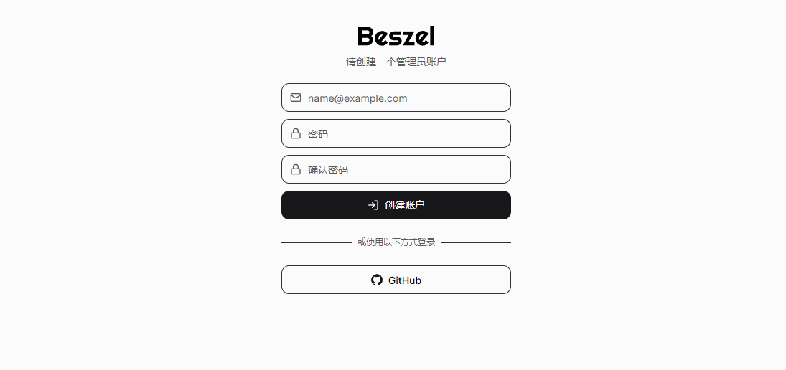
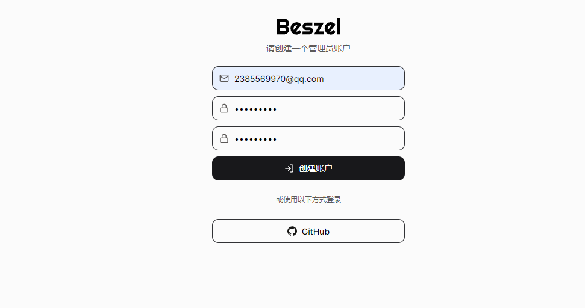
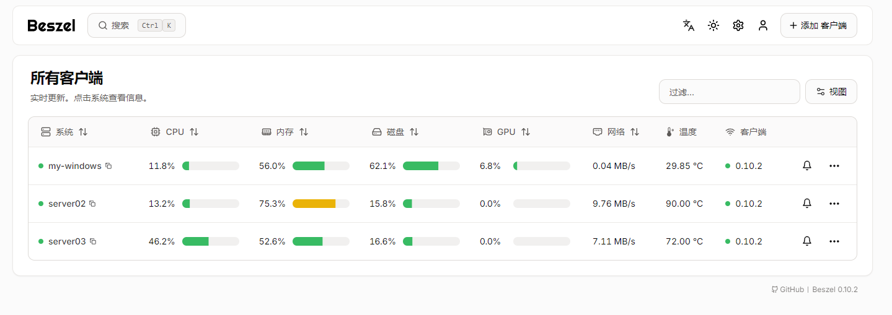

# Beszel

Beszel 是一个轻量级的服务器监控平台，包含 Docker 统计信息、历史数据和警报功能。

它拥有友好的 Web 界面、简单的配置，并且开箱即用。它支持自动备份、多用户、OAuth 身份验证和 API 访问。

- [官网链接](https://beszel.dev/zh/)

服务信息

| IP           | 主机米   | 描述       |
| ------------ | -------- | ---------- |
| 192.168.1.12 | server02 | Hub、Agent |
| 192.168.1.13 | server03 | Agent      |


## 下载软件包

**下载Hub**

```
wget https://github.com/henrygd/beszel/releases/download/v0.10.2/beszel_linux_amd64.tar.gz
```

**下载Agent**

```
wget wget https://github.com/henrygd/beszel/releases/download/v0.10.2/beszel-agent_linux_amd64.tar.gz
```


## 启动中心 (hub) 

在预设的服务端启动hub服务，这里是：192.168.1.12

**解压软件包**

```
sudo tar -zxvf beszel_linux_amd64.tar.gz -C /usr/local/bin/
```

**创建目录**

```
mkdir -p /data/service/beszel
```

**创建Systemd服务**

```
sudo tee /etc/systemd/system/beszel.service <<"EOF"
[Unit]
Description=Beszel Hub
Documentation=https://beszel.dev/zh/
After=network.target
[Service]
Type=simple
WorkingDirectory=/data/service/beszel
ExecStart=/usr/local/bin/beszel serve --http "0.0.0.0:8090" --dir /data/service/beszel
ExecStop=/bin/kill -SIGTERM $MAINPID
Restart=on-failure
RestartSec=30
TimeoutStartSec=120
TimeoutStopSec=180
StartLimitIntervalSec=600
StartLimitBurst=3
KillMode=control-group
KillSignal=SIGTERM
SuccessExitStatus=143
User=admin
Group=ateng
[Install]
WantedBy=multi-user.target
EOF
```

**启动服务**

```
sudo systemctl daemon-reload
sudo systemctl start beszel.service
sudo systemctl enable beszel.service
```

**查看服务状态**

```
sudo systemctl status beszel.service
```

**查看秘钥**

在Hub服务端查看公钥信息，用于后续Agent启动服务使用

```
$ cat /data/service/beszel/id_ed25519.pub
ssh-ed25519 AAAAC3NzaC1lZDI1NTE5AAAAIJTpYQd3H1ley28iysFhxb8Pvp3aT06Lp6Dvk6jVbRup
```


## 启动代理 (agent)

在预设的代理端（需要监控的主机）启动agent服务，这里是：192.168.1.12、192.168.1.13。

**解压软件包**

```
sudo tar -zxvf beszel-agent_linux_amd64.tar.gz -C /usr/local/bin/
```

**创建Systemd服务**

如果有其他额外的硬盘、分区或者挂载点（测试后最好使用挂载点才会有数据）需要监控需要加上环境变量：Environment="EXTRA_FILESYSTEMS=sdb,sdc1,mmcblk0,/mnt/network-share"，这个步骤和监控docker都需要root用户运行。

```
sudo tee /etc/systemd/system/beszel-agent.service <<"EOF"
[Unit]
Description=Beszel Agent
Documentation=https://beszel.dev/zh/
After=network.target
[Service]
Type=simple
ExecStart=/usr/local/bin/beszel-agent -listen "45876" -key "ssh-ed25519 AAAAC3NzaC1lZDI1NTE5AAAAIJTpYQd3H1ley28iysFhxb8Pvp3aT06Lp6Dvk6jVbRup"
ExecStop=/bin/kill -SIGTERM $MAINPID
Restart=on-failure
RestartSec=30
TimeoutStartSec=120
TimeoutStopSec=180
StartLimitIntervalSec=600
StartLimitBurst=3
KillMode=control-group
KillSignal=SIGTERM
SuccessExitStatus=143
User=admin
Group=ateng
[Install]
WantedBy=multi-user.target
EOF
```

**启动服务**

```
sudo systemctl daemon-reload
sudo systemctl start beszel-agent.service
sudo systemctl enable beszel-agent.service
```

**查看服务状态**

```
sudo systemctl status beszel-agent.service
```


## 使用服务

### 创建管理员账户

**访问Web**

- http://192.168.1.12:8090



**创建管理员账户**

第一次使用输入相关信息就初始化为管理员账户




### 添加客户端

使用二进制的方式添加客户端，注意修改IP和端口


添加后如下图所示，其中Windows客户端的启动命令和Linux端类似




