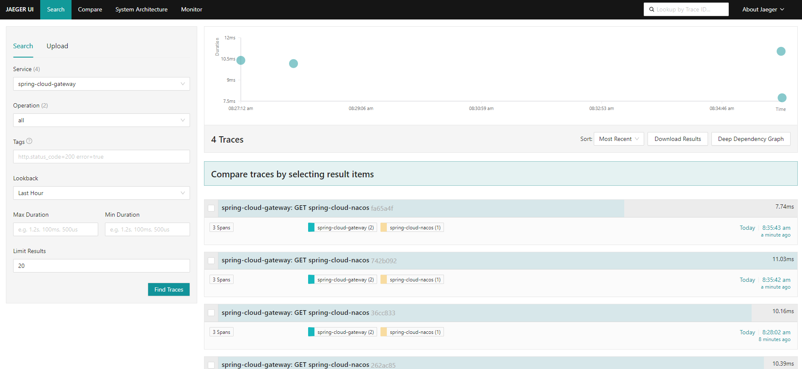
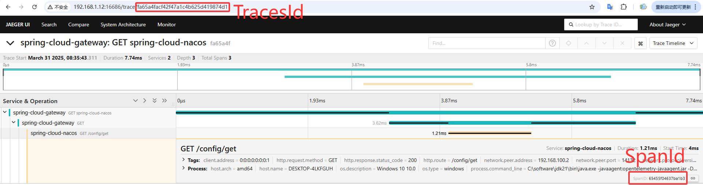
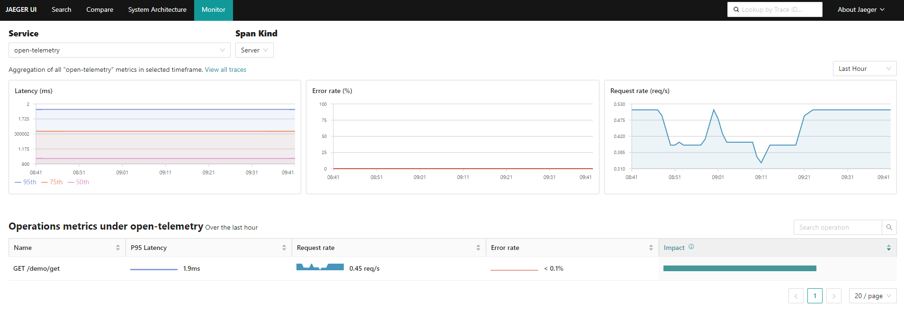
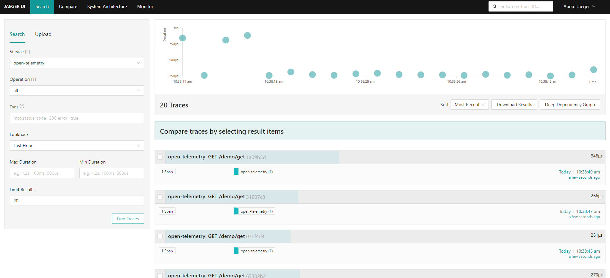

# Jaeger

Jaeger 是一个由 CNCF（Cloud Native Computing Foundation）托管的分布式追踪系统，用于监控和故障排查微服务架构。它提供了分布式上下文的可视化，使开发人员能够追踪请求在各个微服务之间的传播路径，从而更快地发现性能瓶颈和错误。

- [官网链接](https://www.jaegertracing.io/)


## 安装服务

**下载软件包**

```
wget https://github.com/jaegertracing/jaeger/releases/download/v1.67.0/jaeger-2.4.0-linux-amd64.tar.gz
```

**解压软件包**

```
tar -zxvf jaeger-2.4.0-linux-amd64.tar.gz
```

- **`jaeger`**：这是一个多功能的可执行文件，包含了 Jaeger 的所有组件。你可以通过参数指定它的运行模式（如 Agent、Collector、Query 等）。
- **`example-hotrod`**：这是一个示例应用程序，用于生成追踪数据，方便你测试 Jaeger 的功能。

**安装软件包**

```
mv jaeger-2.4.0-linux-amd64/jaeger /usr/local/bin/
```

**清理目录**

```
rm -rf jaeger-2.4.0-linux-amd64/
```


## 启动服务

**编辑配置文件**

创建配置文件

```
sudo mkdir -p /etc/jaeger
sudo chown admin:ateng /etc/jaeger
```

编辑 `/etc/jaeger/config.yaml` 配置文件，添加以下内容

```yaml
service:
  extensions: [jaeger_storage, jaeger_query]
  pipelines:
    traces:
      receivers: [otlp]
      processors: [batch]
      exporters: [jaeger_storage_exporter]
  telemetry:
    resource:
      service.name: jaeger
    metrics:
      level: detailed
      readers:
        - pull:
            exporter:
              prometheus:
                host: 0.0.0.0
                port: 18888

extensions:
  jaeger_storage:
    backends:
      some_trace_storage:
        memory:
          max_traces: 100000
  jaeger_query:
    storage:
      traces: some_trace_storage
    base_path: /
    grpc:
      endpoint: 0.0.0.0:16685
    http:
      endpoint: 0.0.0.0:16686

receivers:
  otlp:
    protocols:
      grpc:
        endpoint: 0.0.0.0:14317
      http:
        endpoint: 0.0.0.0:14318

processors:
  batch:

exporters:
  jaeger_storage_exporter:
    trace_storage: some_trace_storage
```

**启动服务**

```
/usr/local/bin/jaeger --config /etc/jaeger/config.yaml
```

**访问服务**

```
http://192.168.1.12:16686/
```


**查看TracesID和SpanID**

后续有数据推送到Jaeger，就会有Traces数据



点击进去可以看到TracesID和SpanID




## 开机自启

**编辑配置文件**

```
sudo tee /etc/systemd/system/jaeger.service <<"EOF"
[Unit]
Description=Jaeger
Documentation=https://www.jaegertracing.io/
After=network.target
[Service]
Type=simple
ExecStart=/usr/local/bin/jaeger --config /etc/jaeger/config.yaml
ExecStop=/bin/kill -SIGTERM $MAINPID
Restart=on-failure
RestartSec=10
TimeoutStartSec=90
TimeoutStopSec=120
StartLimitIntervalSec=600
StartLimitBurst=3
KillMode=control-group
KillSignal=SIGTERM
SuccessExitStatus=143
User=admin
Group=ateng
[Install]
WantedBy=multi-user.target
EOF
```

**启动服务**

```
sudo systemctl daemon-reload
sudo systemctl enable jaeger.service
sudo systemctl start jaeger.service
```

**查看状态和日志**

```
sudo systemctl status jaeger.service
sudo journalctl -f -u jaeger.service
```


## 配置监控

由 **[OpenTelemetry Collector](https://atengk.github.io/ops/#/work/service/opentelemetry/)** 将 `traces` 和 `metrics` 数据推送到 Jaeger，Jaeger配置prometheus指标，在prometheus中配置该指标拉取数据。

**Otel配置**

在 **[OpenTelemetry Collector](https://atengk.github.io/ops/#/work/service/opentelemetry/)** 中将 `metrics` 也推送一份数据到 Jaeger 中，配置文件关键部分如下：

```yaml
service:
  pipelines:
    traces:
      receivers: [otlp]
      processors: [batch]
      exporters: [debug, otlp/jaeger]
    metrics:
      receivers: [otlp]
      processors: [batch]
      exporters: [debug, prometheus, otlp/jaeger]
```

**编辑配置文件**

编辑 `/etc/jaeger/config.yaml` 配置文件，修改以下内容

```yaml
service:
  extensions: [jaeger_storage, jaeger_query]
  pipelines:
    traces:
      receivers: [otlp]
      processors: [batch]
      exporters: [jaeger_storage_exporter, spanmetrics]
    metrics/spanmetrics:
      receivers: [spanmetrics]
      exporters: [prometheus]
  telemetry:
    resource:
      service.name: jaeger
    metrics:
      level: detailed
      readers:
        - pull:
            exporter:
              prometheus:
                host: 0.0.0.0
                port: 18888

extensions:
  jaeger_storage:
    backends:
      some_trace_storage:
        memory:
          max_traces: 100000
    metric_backends:
      some_metrics_storage:
        prometheus:
          endpoint: http://192.168.1.12:9090
          normalize_calls: true
          normalize_duration: true
  jaeger_query:
    storage:
      traces: some_trace_storage
      metrics: some_metrics_storage
    base_path: /
    grpc:
      endpoint: 0.0.0.0:16685
    http:
      endpoint: 0.0.0.0:16686

connectors:
  spanmetrics:

receivers:
  otlp:
    protocols:
      grpc:
        endpoint: 0.0.0.0:14317
      http:
        endpoint: 0.0.0.0:14318

processors:
  batch:

exporters:
  jaeger_storage_exporter:
    trace_storage: some_trace_storage
  prometheus:
    endpoint: "0.0.0.0:18889"
```

**重启服务**

```
sudo systemctl restart jaeger.service
```

**查看日志**

```
sudo journalctl -f -u jaeger.service
```

**配置Pometheus**

```
$ vi /data/service/prometheus/config/prometheus.yml
  - job_name: "jaeger"
    static_configs:
      - targets: ["192.168.1.12:18889"]
$ curl -X POST http://localhost:9090/-/reload
```

**查看监控**




## 配置存储后端

默认使用的是内存，存储100000条数据。如果需要持久化就需要配置存储后端。

### Badger

Badger是一个可嵌入的持续键值数据库，类似于RockSBD。 Jaeger Binary嵌入了badge，可以将其用作存储后端，而无需外部依赖。

- [官网文档](https://www.jaegertracing.io/docs/2.4/badger/)
- [Github文件参考](https://github.com/jaegertracing/jaeger/blob/v2.4.0/cmd/jaeger/config-badger.yaml)

**编辑配置文件**

编辑 `/etc/jaeger/config.yaml` 配置文件，修改以下内容

```yaml
extensions:
  jaeger_storage:
    backends:
      some_trace_storage:
        badger:
          directories:
            keys: "/tmp/jaeger/"
            values: "/tmp/jaeger/"
          ephemeral: false
```

完整配置文件如下

```yaml
service:
  extensions: [jaeger_storage, jaeger_query]
  pipelines:
    traces:
      receivers: [otlp]
      processors: [batch]
      exporters: [jaeger_storage_exporter]
  telemetry:
    resource:
      service.name: jaeger
    metrics:
      level: detailed
      readers:
        - pull:
            exporter:
              prometheus:
                host: 0.0.0.0
                port: 18888

extensions:
  jaeger_storage:
    backends:
      some_trace_storage:
        badger:
          directories:
            keys: "/tmp/jaeger/"
            values: "/tmp/jaeger/"
          ephemeral: false
    metric_backends:
      some_metrics_storage:
        prometheus:
          endpoint: http://192.168.1.12:9090
          normalize_calls: true
          normalize_duration: true
  jaeger_query:
    storage:
      traces: some_trace_storage
      metrics: some_metrics_storage
    base_path: /
    grpc:
      endpoint: 0.0.0.0:16685
    http:
      endpoint: 0.0.0.0:16686

connectors:
  spanmetrics:

receivers:
  otlp:
    protocols:
      grpc:
        endpoint: 0.0.0.0:14317
      http:
        endpoint: 0.0.0.0:14318

processors:
  batch:

exporters:
  jaeger_storage_exporter:
    trace_storage: some_trace_storage
```

**重启服务**

```
sudo systemctl restart jaeger.service
```

**查看日志**

```
sudo journalctl -f -u jaeger.service
```

**查看数据目录**

```
$ ll /tmp/jaeger/ -h
总用量 76K
-rw-r--r-- 1 admin ateng 2.0G 3月  30 10:36 000001.vlog
-rw-r--r-- 1 admin ateng 128M 3月  30 10:37 00001.mem
-rw-r--r-- 1 admin ateng 1.0M 3月  30 10:36 DISCARD
-rw------- 1 admin ateng   28 3月  30 10:36 KEYREGISTRY
-rw-r--r-- 1 admin ateng    6 3月  30 10:36 LOCK
-rw------- 1 admin ateng   16 3月  30 10:36 MANIFEST
```




### Cassandra

使用 Cassandra 数据库作为后端存储

- [官网文档](https://www.jaegertracing.io/docs/2.4/badger/)
- [Github文件参考](https://github.com/jaegertracing/jaeger/blob/v2.4.0/cmd/jaeger/config-badger.yaml)
- [安装文档](https://atengk.github.io/ops/#/work/kubernetes/service/cassandra/v5.0.3/)

**编辑配置文件**

编辑 `/etc/jaeger/config.yaml` 配置文件，修改以下内容；`create: true` 表示自动创建 keyspace

```yaml
extensions:
  jaeger_storage:
    backends:
      some_storage:
        cassandra:
          schema:
            create: true
            keyspace: ateng_jaeger
            datacenter: datacenter1
            trace_ttl: 48h
            dependencies_ttl: 48h
            compaction_window: 2h
            replication_factor: 1
          connection:
            servers:
              - "192.168.1.10:47023"
            auth:
              basic:
                username: "cassandra"
                password: "Admin@123"
            tls:
              insecure: true
```

完整配置文件如下

```yaml
service:
  extensions: [jaeger_storage, jaeger_query]
  pipelines:
    traces:
      receivers: [otlp]
      processors: [batch]
      exporters: [jaeger_storage_exporter]
  telemetry:
    resource:
      service.name: jaeger
    metrics:
      level: detailed
      readers:
        - pull:
            exporter:
              prometheus:
                host: 0.0.0.0
                port: 18888

extensions:
  jaeger_storage:
    backends:
      some_trace_storage:
        cassandra:
          schema:
            create: true
            keyspace: ateng_jaeger
            datacenter: datacenter1
            trace_ttl: 48h
            dependencies_ttl: 48h
            compaction_window: 2h
            replication_factor: 1
          connection:
            servers:
              - "192.168.1.10:47023"
            auth:
              basic:
                username: "cassandra"
                password: "Admin@123"
            tls:
              insecure: true
    metric_backends:
      some_metrics_storage:
        prometheus:
          endpoint: http://192.168.1.12:9090
          normalize_calls: true
          normalize_duration: true
  jaeger_query:
    storage:
      traces: some_trace_storage
      metrics: some_metrics_storage
    base_path: /
    grpc:
      endpoint: 0.0.0.0:16685
    http:
      endpoint: 0.0.0.0:16686

connectors:
  spanmetrics:

receivers:
  otlp:
    protocols:
      grpc:
        endpoint: 0.0.0.0:14317
      http:
        endpoint: 0.0.0.0:14318

processors:
  batch:

exporters:
  jaeger_storage_exporter:
    trace_storage: some_trace_storage
```

**重启服务**

```
sudo systemctl restart jaeger.service
```

**查看日志**

```
sudo journalctl -f -u jaeger.service
```


## 部署分离

将 Collector 和 Query 分离部署，需要使用同一个远端存储（Cassandra）

### Collector

```
service:
  extensions: [jaeger_storage]
  pipelines:
    traces:
      receivers: [otlp]
      processors: [batch]
      exporters: [jaeger_storage_exporter]
  telemetry:
    resource:
      service.name: jaeger-collector
    metrics:
      level: detailed
      readers:
        - pull:
            exporter:
              prometheus:
                host: 0.0.0.0
                port: 18888

extensions:
  jaeger_storage:
    backends:
      some_trace_storage:
        cassandra:
          schema:
            create: true
            keyspace: ateng_jaeger
            datacenter: datacenter1
            trace_ttl: 48h
            dependencies_ttl: 48h
            compaction_window: 2h
            replication_factor: 1
          connection:
            servers:
              - "192.168.1.10:47023"
            auth:
              basic:
                username: "cassandra"
                password: "Admin@123"
            tls:
              insecure: true
    metric_backends:
      some_metrics_storage:
        prometheus:
          endpoint: http://192.168.1.12:9090
          normalize_calls: true
          normalize_duration: true

connectors:
  spanmetrics:

receivers:
  otlp:
    protocols:
      grpc:
        endpoint: 0.0.0.0:14317
      http:
        endpoint: 0.0.0.0:14318

processors:
  batch:

exporters:
  jaeger_storage_exporter:
    trace_storage: some_trace_storage
```


### Query

```
service:
  extensions: [jaeger_storage, jaeger_query]
  pipelines:
    traces:
      receivers: [nop]
      processors: [batch]
      exporters: [nop]
  telemetry:
    resource:
      service.name: jaeger-query
    metrics:
      level: detailed
      readers:
        - pull:
            exporter:
              prometheus:
                host: 0.0.0.0
                port: 18887

extensions:
  jaeger_storage:
    backends:
      some_trace_storage:
        cassandra:
          schema:
            create: true
            keyspace: ateng_jaeger
            datacenter: datacenter1
            trace_ttl: 48h
            dependencies_ttl: 48h
            compaction_window: 2h
            replication_factor: 1
          connection:
            servers:
              - "192.168.1.10:47023"
            auth:
              basic:
                username: "cassandra"
                password: "Admin@123"
            tls:
              insecure: true
    metric_backends:
      some_metrics_storage:
        prometheus:
          endpoint: http://192.168.1.12:9090
          normalize_calls: true
          normalize_duration: true
  jaeger_query:
    storage:
      traces: some_trace_storage
      metrics: some_metrics_storage
    base_path: /
    grpc:
      endpoint: 0.0.0.0:16685
    http:
      endpoint: 0.0.0.0:16686

connectors:
  spanmetrics:

receivers:
  nop:

processors:
  batch:

exporters:
  nop:
```

