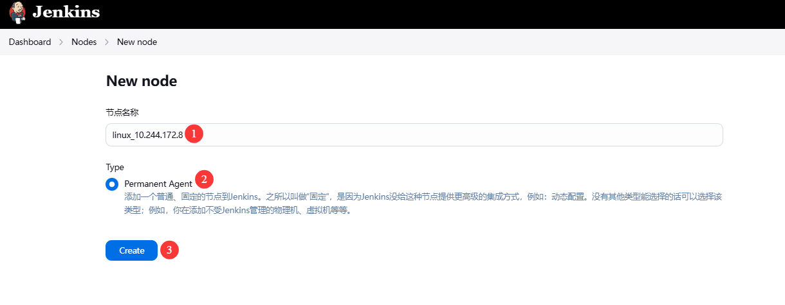
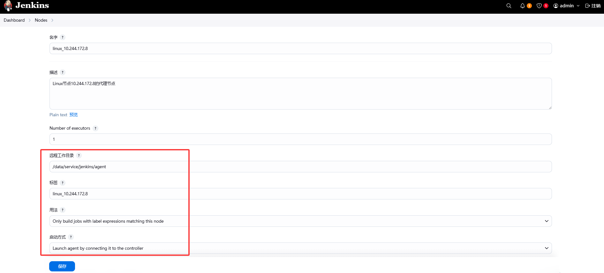
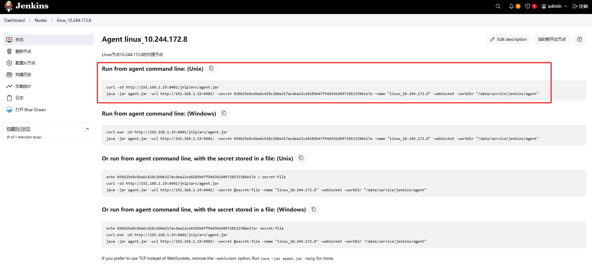

# Jenkins

Jenkins 是一个开源的自动化服务器，广泛用于实现持续集成（CI）和持续交付（CD）。它支持通过插件扩展，能够自动化构建、测试、部署等软件开发流程。Jenkins 提供了图形化的用户界面、分布式构建功能、丰富的插件生态以及强大的集成能力，帮助开发团队提高开发效率和交付速度。

- [官网链接](https://www.jenkins.io/)

- [Docker安装Jenkins文档](/work/docker/service/jenkins/)
- [Kubernetes安装Jenkins文档](/work/kubernetes/service/jenkins/v2.492.2/)


## 安装Jenkins

尽量通过原生Linux安装，避免不必要的依赖和软件问题

### 前置需要

需要安装JDK，通过JDK启动Jenkins

- [JDK安装文档](/work/service/openjdk/openjdk21/)

其他工具安装参考文档

- [Maven安装文档](/work/service/maven/v3.9.9/)
- [Git安装文档](/work/service/git/v2.49.0/)
- [NVM 和 Node.js 安装文档](/work/service/nvm/v0.40.2/)
- [Docker安装文档](/work/docker/deploy/v27.3.1/)

### 配置Jenkins

在 [下载页面](https://www.jenkins.io/download/) 下载 war 包

```
wget https://get.jenkins.io/war-stable/2.492.3/jenkins.war
```

创建war目录和数据目录

```
mkdir -p /usr/local/software/jenkins /data/service/jenkins
```

拷贝 war 包

```
cp jenkins.war /usr/local/software/jenkins
```

配置环境变量

```
cat >> ~/.bash_profile <<"EOF"
## JENKINS_HOME
export JENKINS_HOME=/data/service/jenkins
EOF
source ~/.bash_profile
```

### 启动Jenkins

编辑Systemd配置文件，根据实际情况修改JVM参数和端口

```
sudo tee /etc/systemd/system/jenkins.service <<"EOF"
[Unit]
Description=Jenkins
Documentation=https://www.jenkins.io/
After=network.target
[Service]
Type=simple
WorkingDirectory=/data/service/jenkins
Environment="JENKINS_HOME=/data/service/jenkins"
ExecStart=/usr/local/software/jdk21/bin/java -jar \
          -server -Xms1g -Xmx2g \
          /usr/local/software/jenkins/jenkins.war \
          --httpPort=8401 --httpListenAddress=0.0.0.0
ExecStop=/bin/kill -SIGTERM $MAINPID
Restart=on-failure
RestartSec=30
TimeoutStartSec=120
TimeoutStopSec=180
StartLimitIntervalSec=600
StartLimitBurst=3
KillMode=control-group
KillSignal=SIGTERM
SuccessExitStatus=143
User=admin
Group=ateng
[Install]
WantedBy=multi-user.target
EOF
```

**启动服务**

```
sudo systemctl daemon-reload
sudo systemctl enable jenkins.service
sudo systemctl start jenkins.service
```

**查看服务状态和日志**

```
sudo systemctl status jenkins.service
sudo journalctl -f -u jenkins.service --lines=50
```

**查看admin用户密码**

```
cat /data/service/jenkins/secrets/initialAdminPassword
```

**登录Web**

```
URL: http://192.168.1.12:8401
Username: admin
Password: xxx
```


进入后跳过插件安装


进入jenkins后修改admin用户密码


## 添加节点

添加一个固定的节点，该步骤可以跳过。这里只是演示一下添加一个固定节点的步骤

### 前置需要

- Jenkins 主节点已安装并运行
- 从节点（Agent）机器已安装 Java（通常需要 Java 8+），[JDK安装文档](/work/service/openjdk/openjdk21/)
- 主节点和从节点网络互通

其他工具安装参考文档

- [Maven安装文档](/work/service/maven/v3.9.9/)
- [Git安装文档](/work/service/git/v2.49.0/)
- [NVM 和 Node.js 安装文档](/work/service/nvm/v0.40.2/)
- [Docker安装文档](/work/docker/deploy/v27.3.1/)

### 添加节点

在 `Manage Jenkins` → `Nodes` → `New Node` 添加一个固定的节点

- 节点名称：linux_10.244.172.8
- 勾选Type的Permanent Agent



修改以下选项：

- 远程工作目录（Remote root directory）：这是从节点上 Jenkins 用来存放构建文件、工作空间等数据的目录
- 标签（Labels）：这是给该节点打的“标签”，可以在流水线中通过 `label` 来选择这个节点
- 用法（Usage）：Only build jobs with label expressions matching this node（只有标签匹配该节点的任务才会在此节点运行）
- 启动方式（Launch method）：Launch agent by connecting it to the controller，让从节点主动通过 JNLP（Java Web Start）方式连接 Jenkins 主节点



保存后再点击进入节点，在代理节点执行以下命令

注意这个 `-webSocket` 参数，在新版本的 Jenkins 中（特别是 2.321+ 之后），**JNLP agent 支持通过 WebSocket 通信**，**不再强依赖 TCP 端口**。

```
mkdir -p /data/service/jenkins/agent
cd /data/service/jenkins/agent
curl -sO http://192.168.1.19:8401/jnlpJars/agent.jar
java -jar agent.jar -url http://192.168.1.19:8401/ -secret 036b25e8c6ba6c428c1b0a317acdea22ce8185b47f94d341d49718523386e17a -name "linux_10.244.172.8" -webSocket -workDir "/data/service/jenkins/agent"
```



查看代理节点信息


### 设置开机自启

**编辑配置文件**

```
sudo tee /etc/systemd/system/jenkins-agent.service <<"EOF"
[Unit]
Description=Jenkins Agent Node
Documentation=https://www.jenkins.io
After=network.target
[Service]
Type=simple
WorkingDirectory=/data/service/jenkins/agent
ExecStart=/usr/local/software/jdk21/bin/java \
          -Xms256m -Xmx1024m \
          -jar agent.jar \
          -url http://192.168.1.19:8401/ \
          -secret 036b25e8c6ba6c428c1b0a317acdea22ce8185b47f94d341d49718523386e17a \
          -name "linux_10.244.172.8" -webSocket \
          -workDir "/data/service/jenkins/agent"
ExecStop=/bin/kill -SIGTERM $MAINPID
Restart=on-failure
RestartSec=30
TimeoutStartSec=120
TimeoutStopSec=180
StartLimitIntervalSec=600
StartLimitBurst=3
KillMode=control-group
KillSignal=SIGTERM
SuccessExitStatus=143
User=admin
Group=ateng
[Install]
WantedBy=multi-user.target
EOF
```

**启动服务**

```
sudo systemctl daemon-reload
sudo systemctl enable jenkins-agent.service
sudo systemctl start jenkins-agent.service
sudo systemctl status jenkins-agent.service
```

**查看服务状态**

```
sudo systemctl status jenkins-agent.service
```

**查看服务日志**

```
sudo journalctl -f -u jenkins-agent.service
```


### 使用代理节点

在流水线脚本中配置 `agent { label 'linux_10.244.172.8' }` ，通过 `label` 来选择这个节点

```groovy
pipeline {
    agent { label 'linux_10.244.172.8' }

    stages {
        stage('Build') {
            steps {
                echo 'Running on my-agent node'
                // 你的构建命令
                sh 'ip a'
                sh 'env'
                sh 'pwd && ls -la'
            }
        }
    }
}
```

