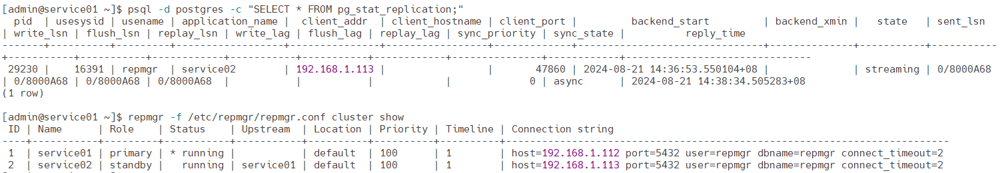

# 编译和安装PostgreSQL

最小化安装，没有安装额外的插件扩展

| IP            | 主机名    | 说明   |
| ------------- | --------- | ------ |
| 192.168.1.112 | service01 | 主节点 |
| 192.168.1.113 | service02 | 从节点 |
| 192.168.1.114 | service03 | 从节点 |


## 安装软件包

**安装依赖工具和库**

```
sudo yum -y install gcc gcc-c++ libicu-devel readline-devel zlib-devel
```

**下载 PostgreSQL 源码**

下载PostgreSQL源码：https://www.postgresql.org/ftp/source/

```
wget https://ftp.postgresql.org/pub/source/v16.3/postgresql-16.3.tar.gz
tar -xzf postgresql-16.3.tar.gz
cd postgresql-16.3
```

**配置**

运行 `./configure` 脚本来检测系统环境并生成相应的Makefile。你可以指定安装目录以及其他选项。例如：

```
./configure --prefix=/usr/local/software/postgresql-16.3
```

**编译和安装**

使用 `make` 命令编译源码：

```
make -j$(nproc)
```

编译完成后，使用以下命令进行安装：

```
make install
```

**编译和安装插件**

```
cd contrib
make -j$(nproc)
make install
```

**查看目录**

```
ll /usr/local/software/postgresql-16.3
ll /usr/local/software/postgresql-16.3/share/extension
/usr/local/software/postgresql-16.3/bin/pg_ctl --version
```

**更新库缓存**

```
echo "/usr/local/software/postgresql-16.3/lib" | sudo tee /etc/ld.so.conf.d/postgresql-16.3.conf
sudo ldconfig
```


## 配置PostgreSQL

### 基础配置

**创建软链接**

```
ln -s /usr/local/software/postgresql-16.3 /usr/local/software/postgresql
```

**配置环境变量**

```
cat >> ~/.bash_profile <<"EOF"
## POSTGRESQL_HOME
export POSTGRESQL_HOME=/usr/local/software/postgresql
export PATH=$PATH:$POSTGRESQL_HOME/bin
EOF
source ~/.bash_profile
```

**查看版本**

```
pg_ctl --version
```

### 初始化

**初始化数据目录**

```sh
initdb -D /data/service/postgresql
```

### **修改配置文件**

**配置include目录**

```
$ vi +810 /data/service/postgresql/postgresql.conf
include_dir = 'conf.d'
$ mkdir /data/service/postgresql/conf.d
```

**创建配置文件**

```
cat > /data/service/postgresql/conf.d/override.conf <<EOF
port = 5432
listen_addresses = '0.0.0.0'
max_connections = 1024
shared_buffers = 4GB
work_mem = 64MB
max_parallel_workers_per_gather = 4
max_parallel_maintenance_workers = 2
max_parallel_workers = 8
wal_level = 'logical'
log_timezone = 'Asia/Shanghai'
timezone = 'Asia/Shanghai'
EOF
```

**配置客户端认证**

编辑 `pg_hba.conf` 文件以允许远程连接。添加一行以允许所有IP地址的所有用户使用密码认证（你可以根据需要限制访问）：

```
cat >> /data/service/postgresql/pg_hba.conf <<EOF
host    all             all             0.0.0.0/0               md5
EOF
```

如果你只想允许特定IP地址范围，你可以更改 `0.0.0.0/0` 为一个更具体的CIDR地址范围，例如 `192.168.1.0/24`。

### 启动服务

**配置系统服务**：

创建一个systemd服务文件以便管理PostgreSQL服务：

```
sudo tee /etc/systemd/system/postgresql.service <<"EOF"
[Unit]
Description=PostgreSQL database server
After=network-online.target

[Service]
Type=forking
Restart=always
RestartSec=10
User=admin
Group=ateng
ExecStart=/usr/local/software/postgresql/bin/pg_ctl -D /data/service/postgresql --log /data/service/postgresql/postgresql.log start
ExecStop=/usr/local/software/postgresql/bin/pg_ctl stop -D /data/service/postgresql -s -m fast
ExecReload=/usr/local/software/postgresql/bin/pg_ctl reload -D /data/service/postgresql -s

[Install]
WantedBy=multi-user.target
EOF
```

**重新加载systemd并启动PostgreSQL服务**

```
sudo systemctl daemon-reload
sudo systemctl start postgresql
sudo systemctl enable postgresql
```

### 创建用户

**登录PostgreSQL**

```
psql -d postgres
```

**创建超级用户**

```
CREATE USER root WITH PASSWORD 'Admin@123' SUPERUSER;
\du
```

创建数据库

```
CREATE DATABASE kongyu OWNER root;
```

使用超级用户远程访问

```
$ PGPASSWORD='Admin@123' psql -h 192.168.1.112 -p 5432 -U root kongyu
kongyu=# \l
```


## 配置主从

### 配置主服务器

**编辑 `postgresql.conf`**

在主服务器上，编辑 `postgresql.conf` 文件以启用 WAL 日志归档和流复制。

```
$ vi /data/service/postgresql/conf.d/override.conf
archive_mode = on
archive_command = 'cp %p /data/service/postgresql/archive/%f'
max_wal_senders = 10
wal_keep_size = 1024
```

**编辑 `pg_hba.conf`**

配置允许从服务器的连接。

```
$ vi /data/service/postgresql/pg_hba.conf
host    replication     all             0.0.0.0/0               md5
```

**创建复制用户**

在主服务器上，为复制配置创建一个用户。

```
psql -d postgres -c "CREATE ROLE replication WITH REPLICATION PASSWORD 'Admin@123' LOGIN;"
```

**重启 PostgreSQL 服务**

重启主服务器上的 PostgreSQL 服务以应用更改。

```
sudo systemctl restart postgresql
```

### 配置从服务器

**停止 PostgreSQL 服务**

在从服务器上，首先停止 PostgreSQL 服务：

```
sudo systemctl stop postgresql
```

**清空数据目录并进行基础备份**

清空从服务器的数据目录，并从主服务器复制数据。

```shell
# 清空数据目录
rm -rf /data/service/postgresql/*

# 使用 pg_basebackup 从主服务器复制数据
PGPASSWORD='Admin@123' pg_basebackup -h 192.168.1.112 -D /data/service/postgresql -U replication -P -R
```

**确保从服务器配置正确**

确认 `pg_basebackup` 创建了 `standby.signal` 文件，从而使从服务器进入恢复模式。

```
ll /data/service/postgresql/standby.signal
```

**启动从服务器**

从服务器配置完成后，启动 PostgreSQL 服务。

```
sudo systemctl start postgresql
```

### 验证主从配置

**在主服务器上查看复制状态**

使用以下命令验证从服务器是否连接并正常工作：

```
psql -d postgres -c "SELECT * FROM pg_stat_replication;"
```

**在从服务器上查看恢复模式**

使用以下命令验证从服务器是否处于恢复模式：

```
psql -d postgres -c "SELECT pg_is_in_recovery();"
```

如果返回值为 t，表示从服务器处于恢复模式，主从配置成功。


## 安装 repmgr

需要添加主从的配置参数

### 安装repmgr插件

**安装开发包**

```
sudo yum -y install libcurl-devel json-c-devel flex
```

**解压软件包**

```
wget https://repmgr.org/download/repmgr-5.4.1.tar.gz
tar -xvzf repmgr-5.4.1.tar.gz
cd repmgr-5.4.1
```

**编译和安装 `repmgr`**

```
./configure
make
make install
```

**编辑配置文件**

```
$ vi /data/service/postgresql/conf.d/override.conf
shared_preload_libraries = 'repmgr'
wal_log_hints = on
```

**创建 `.pgpass` 文件**

`.pgpass` 文件用于存储 PostgreSQL 的密码，以便在执行需要身份验证的命令时自动提供密码。文件应该放在每个用户的主目录下。

```
tee ~/.pgpass <<EOF
192.168.1.112:5432:*:repmgr:Admin@123
192.168.1.113:5432:*:repmgr:Admin@123
EOF
chmod 600 ~/.pgpass
```

这表示对于主机 `192.168.1.112`、端口 `5432`、所有数据库 (`*`)、用户名 `repmgr`，使用密码 `Admin@123`。

### 配置 PostgreSQL 主服务器

**创建 `repmgr` 用户和数据库**

使用 `psql` 创建 `repmgr` 用户，并授予其复制权限：

```
$ psql -d postgres
CREATE USER repmgr WITH PASSWORD 'Admin@123' SUPERUSER;
CREATE DATABASE repmgr OWNER repmgr;
```

**重启 PostgreSQL 服务**

完成以上配置后，重启 PostgreSQL 以使更改生效：

```
sudo systemctl restart postgresql
```

### 在主服务器上配置 repmgr

**创建并编辑 `repmgr.conf` 文件**

在主服务器上创建 `repmgr` 的配置文件，并进行配置：

```
sudo mkdir -p /etc/repmgr
sudo vi /etc/repmgr.conf
```

添加以下配置内容：

```
node_id=1
node_name='service01'
conninfo='host=192.168.1.112 port=5432 user=repmgr dbname=repmgr connect_timeout=2'
data_directory='/data/service/postgresql'
log_level='INFO'
use_replication_slots=yes
failover = automatic
priority = 100
monitoring_history=true
monitor_interval_secs=5
reconnect_attempts=10
reconnect_interval=5
promote_command='/usr/local/software/postgresql/bin/repmgr standby promote -f /etc/repmgr.conf --log-to-file'
follow_command='/usr/local/software/postgresql/bin/repmgr standby follow -f /etc/repmgr.conf --log-to-file --upstream-node-id=%n'
```

这些配置项的作用如下：

- `node_id=1`：为主服务器指定一个唯一的节点 ID。
- `node_name='primary'`：为主服务器指定一个名称。
- `conninfo`：定义 `repmgr` 连接到 PostgreSQL 所需的信息。
- `data_directory='/data/service/postgresql'`：指定数据目录路径。
- `log_level='INFO'` ：设置日志记录级别。
- `use_replication_slots=yes`：启用复制槽，以防止 WAL 日志被删除。

**注册主服务器**

使用 `repmgr` 注册主服务器：

```
repmgr primary register
```

**查看集群状态**

```
repmgr cluster show
```

### 在从服务器上配置 repmgr

**创建并编辑 `repmgr.conf` 文件**

在从服务器上创建并配置 `repmgr.conf` 文件：

```
sudo mkdir -p /etc/repmgr
sudo vi /etc/repmgr.conf
```

添加以下配置内容：

```
node_id=2
node_name='service02'
conninfo='host=192.168.1.113 port=5432 user=repmgr dbname=repmgr connect_timeout=2'
data_directory='/data/service/postgresql'
log_level='INFO'
use_replication_slots=yes
failover = automatic
priority = 100
monitoring_history=true
monitor_interval_secs=5
reconnect_attempts=10
reconnect_interval=5
promote_command='/usr/local/software/postgresql/bin/repmgr standby promote -f /etc/repmgr.conf --log-to-file'
follow_command='/usr/local/software/postgresql/bin/repmgr standby follow -f /etc/repmgr.conf --log-to-file --upstream-node-id=%n'
```

**克隆到从库**

```
sudo systemctl stop postgresql.service
repmgr -h 192.168.1.112 -U repmgr -d repmgr --force standby clone
sudo systemctl start postgresql.service
```

**注册从服务器**

注册从节点

```
repmgr standby register
```

### 查看集群

在主节点查看

**查看复制状态**

```
psql -d postgres -c "SELECT * FROM pg_stat_replication;"
```

**查看集群状态**

```
repmgr cluster show
```



### 启动repmgrd服务

**创建repmgrd.service**

```
sudo tee /etc/systemd/system/repmgrd.service <<"EOF"
[Unit]
Description=PostgreSQL Replication Manager Daemon
After=network.target

[Service]
Type=simple
User=admin
Group=ateng
ExecStart=/usr/local/software/postgresql/bin/repmgrd --daemonize=false -f /etc/repmgr.conf
ExecReload=/bin/kill -HUP $MAINPID
KillMode=process
Restart=on-failure

[Install]
WantedBy=multi-user.target
EOF
```

**启动服务**

```
sudo systemctl daemon-reload
sudo systemctl start repmgrd
sudo systemctl enable repmgrd
```


## 创建数据

连接到 PostgreSQL 数据库

```
psql -d kongyu
```

创建表

```sql
CREATE TABLE employees (
    id SERIAL PRIMARY KEY,
    name TEXT NOT NULL,
    position TEXT NOT NULL,
    salary INT
);
```

插入数据

```sql
INSERT INTO employees (name, position, salary) VALUES ('Alice', 'Manager', 80000);
INSERT INTO employees (name, position, salary) VALUES ('Bob', 'Developer', 60000);
INSERT INTO employees (name, position, salary) VALUES ('Charlie', 'Designer', 55000);
```

查看数据

```sql
SELECT * FROM employees;
```

