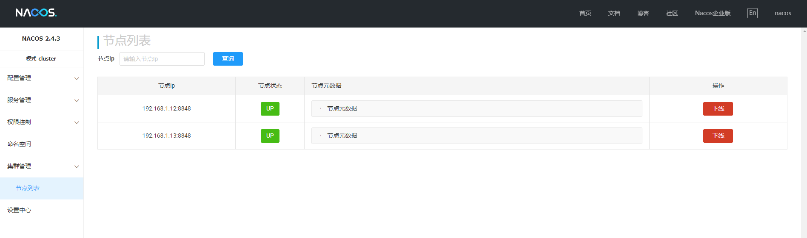

# Nacos

Nacos（"Dynamic Naming and Configuration Service"）是一个开源的动态服务发现、配置管理和服务管理平台，主要用于云原生应用和微服务架构中。它由阿里巴巴开源，旨在帮助开发者构建灵活、高可用的分布式系统。

Nacos通常与微服务架构中的其他组件一起使用，像是 Spring Cloud、Dubbo 等，成为分布式系统中服务治理和配置管理的重要一环。

- [官方文档](https://nacos.io/docs/v2.4/overview/)
- [GitHub](https://github.com/alibaba/nacos)


## 基础配置

**下载软件包**

```
wget https://github.com/alibaba/nacos/releases/download/2.4.3/nacos-server-2.4.3.tar.gz
```

**解压软件包**

```
tar -zxvf nacos-server-2.4.3.tar.gz
mv nacos /usr/local/software/nacos-server-2.4.3
ln -s /usr/local/software/nacos-server-2.4.3 /usr/local/software/nacos
```

**创建环境变量**

```
cat > /usr/local/software/nacos/conf/nacos.env <<EOF
JAVA_HOME=/usr/local/software/jdk8
JAVA_OPT_EXT="-Xms1g -Xmx1g"
PATH=/usr/local/sbin:/usr/local/bin:/usr/sbin:/usr/bin:$JAVA_HOME/bin
EOF
```


## 单机部署

文档使用以下1台服务器，具体服务分配见描述的进程

| IP地址       | 主机名   | 描述  |
| ------------ | -------- | ----- |
| 192.168.1.12 | server02 | Nacos |


### 配置文件修改

### 设置服务自启

**编辑配置文件**

```
sudo tee /etc/systemd/system/nacos.service <<"EOF"
[Unit]
Description=Nacos
Documentation=https://nacos.io
After=network.target
[Service]
Type=forking
WorkingDirectory=/usr/local/software/nacos
EnvironmentFile=-/usr/local/software/nacos/conf/nacos.env
ExecStart=/usr/local/software/nacos/bin/startup.sh -m standalone
ExecStop=/bin/kill -SIGTERM $MAINPID
Restart=on-failure
RestartSec=30
TimeoutStartSec=120
TimeoutStopSec=180
StartLimitIntervalSec=600
StartLimitBurst=3
KillMode=control-group
KillSignal=SIGTERM
SuccessExitStatus=143
User=admin
Group=ateng
[Install]
WantedBy=multi-user.target
EOF
```

**启动服务**

```
sudo systemctl daemon-reload
sudo systemctl enable nacos.service
sudo systemctl start nacos.service
```

**查看状态**

```
systemctl status nacos.service
journalctl -f -u nacos.service
```

**查看日志**

```
tail -f  /usr/local/software/nacos/logs/nacos.log
```

### 访问服务

```
URL: http://192.168.1.13:8848/nacos
```


## 集群部署

文档使用以下1台服务器，具体服务分配见描述的进程

| IP地址       | 主机名   | 描述  |
| ------------ | -------- | ----- |
| 192.168.1.12 | server02 | Nacos |
| 192.168.1.13 | server03 | Nacos |


### 导入SQL

下载SQL文件，将SQL导入MySQL中。

```
curl -L -O https://raw.githubusercontent.com/alibaba/nacos/2.4.3/distribution/conf/mysql-schema.sql
```

### 配置文件修改

修改以下参数

```
$ vi /usr/local/software/nacos/conf/application.properties
```

- 配置端口和路径

```
server.port=8848
server.servlet.contextPath=/nacos
```

- 配置鉴权

```
nacos.core.auth.enabled=true
nacos.core.auth.server.identity.key=ateng
nacos.core.auth.server.identity.value=kongyu
nacos.core.auth.plugin.nacos.token.secret.key=SGVsbG9Xb3JsZC1NeU5hbWVLb25neXUtQWx3YXlzU3RheVBvc2l0aXZl
nacos.core.auth.plugin.nacos.token.expire.seconds=86400
```

- 配置MySQL数据库

```
spring.datasource.platform=mysql
db.num=1
db.url.0=jdbc:mysql://192.168.1.10:21489/ateng_nacos?characterEncoding=utf8&connectTimeout=1000&socketTimeout=3000&autoReconnect=true&useUnicode=true&useSSL=false&serverTimezone=UTC
db.user.0=root
db.password.0=Admin@123
```

### 配置集群配置文件

```
$ vi /usr/local/software/nacos/conf/cluster.conf
# ip:port
192.168.1.12:8848
192.168.1.13:8848
```

### 拷贝配置文件

将配置文件拷贝到集群其他节点

```
scp /usr/local/software/nacos/conf/{cluster.conf,application.properties} server02:/usr/local/software/nacos/conf
```


### 设置服务自启

**编辑配置文件**

```
sudo tee /etc/systemd/system/nacos.service <<"EOF"
[Unit]
Description=Nacos
Documentation=https://nacos.io
After=network.target
[Service]
Type=forking
WorkingDirectory=/usr/local/software/nacos
EnvironmentFile=-/usr/local/software/nacos/conf/nacos.env
ExecStart=/usr/local/software/nacos/bin/startup.sh
ExecStop=/bin/kill -SIGTERM $MAINPID
Restart=on-failure
RestartSec=30
TimeoutStartSec=120
TimeoutStopSec=180
StartLimitIntervalSec=600
StartLimitBurst=3
KillMode=control-group
KillSignal=SIGTERM
SuccessExitStatus=143
User=admin
Group=ateng
[Install]
WantedBy=multi-user.target
EOF
```

**启动服务**

```
sudo systemctl daemon-reload
sudo systemctl enable nacos.service
sudo systemctl start nacos.service
```

**查看状态**

```
systemctl status nacos.service
journalctl -f -u nacos.service
```

**查看日志**

```
tail -f  /usr/local/software/nacos/logs/nacos.log
```

### 访问服务

使用集群中任一IP都可以直接访问Nacos

```
URL: http://192.168.1.13:8848/nacos
```


查看集群列表

