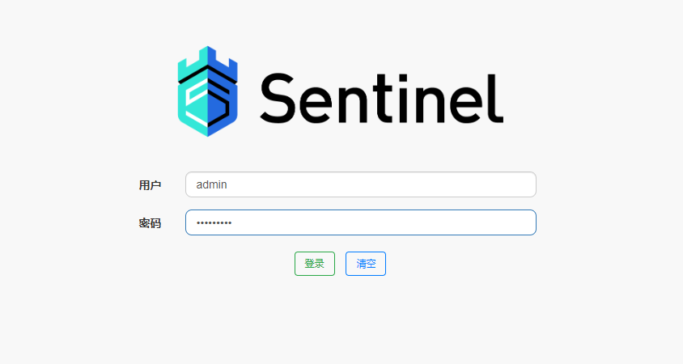

# Sentinel

**Sentinel** 是阿里巴巴开源的 **流量控制** 和 **熔断降级** 框架，专注于保障 **分布式系统稳定性**。它提供 **限流**（QPS/并发控制）、**熔断降级**（失败率、响应时间触发）、**热点参数限流**、**系统自适应保护** 等功能，并支持 **Sentinel Dashboard** 进行可视化监控和动态规则管理。Sentinel 可与 **Spring Cloud、Dubbo、Nacos** 等无缝集成，广泛应用于 **高并发场景**，如电商、支付系统等，有效防止流量突增导致的系统崩溃。

- [官网链接](https://sentinelguard.io/zh-cn/index.html)


## 基础配置

**下载软件包**

```
mkdir /usr/local/software/sentinel
wget -P /usr/local/software/sentinel https://github.com/alibaba/Sentinel/releases/download/1.8.8/sentinel-dashboard-1.8.8.jar
```


## 单机部署

文档使用以下1台服务器，具体服务分配见描述的进程

| IP地址       | 主机名   | 描述     |
| ------------ | -------- | -------- |
| 192.168.1.12 | server02 | Sentinel |


### 设置服务自启

**编辑配置文件**

```
sudo tee /etc/systemd/system/sentinel.service <<"EOF"
[Unit]
Description=Sentinel
Documentation=https://sentinelguard.io/zh-cn
After=network.target
[Service]
Type=simple
WorkingDirectory=/usr/local/software/sentinel
ExecStart=/usr/local/software/jdk8/bin/java -server -Xms512m -Xmx2048m -Dproject.name=sentinel-dashboard -Dserver.port=8858 -Dcsp.sentinel.api.port=8719 -Dsentinel.dashboard.auth.username=admin -Dsentinel.dashboard.auth.password=Admin@123 -jar sentinel-dashboard-1.8.8.jar
ExecStop=/bin/kill -SIGTERM $MAINPID
Restart=on-failure
RestartSec=30
TimeoutStartSec=120
TimeoutStopSec=180
StartLimitIntervalSec=600
StartLimitBurst=3
KillMode=control-group
KillSignal=SIGTERM
SuccessExitStatus=143
User=admin
Group=ateng
[Install]
WantedBy=multi-user.target
EOF
```

**启动服务**

```
sudo systemctl daemon-reload
sudo systemctl enable sentinel.service
sudo systemctl start sentinel.service
```

**查看状态**

```
systemctl status sentinel.service
journalctl -f -u sentinel.service
```

### 访问服务

```
URL: http://192.168.1.12:8858
Username: admin
Password: Admin@123
```


