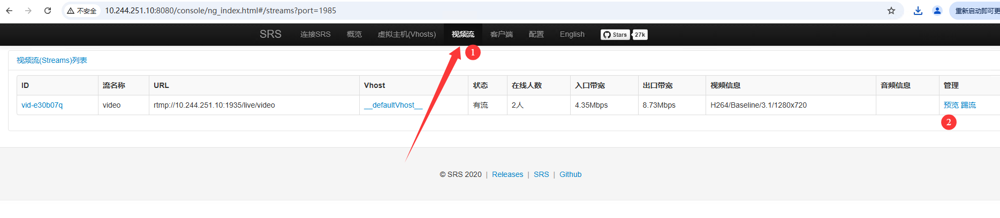
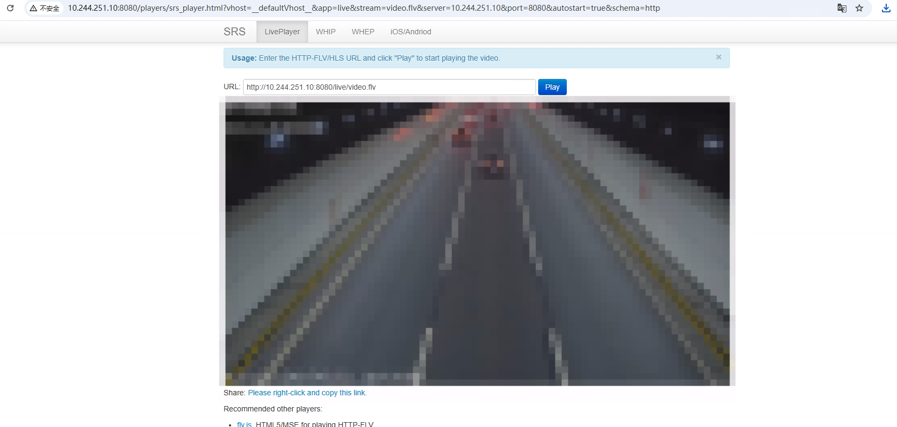

# SRS使用文档


## 推流

使用 FFmpeg 将视频推送到SRS服务器

```
ffmpeg -re -stream_loop -1 -i clip.mp4 -vf "scale=1280:720,fps=15" \
    -c:v libx264 -preset ultrafast -c:a aac -b:a 64k \
    -f flv rtmp://10.244.251.10/live/video
```

预览推流的视频



